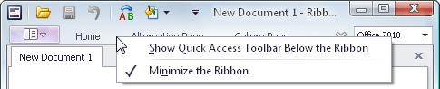

# Minimize Ribbon
To minimize the Ribbon, right-click any command and select **Minimize the Ribbon**:

To restore the Ribbon, right-click any command or page and uncheck the **Minimize the Ribbon** option:

You can also minimize and restore the Ribbon by double-clicking any tab page header.