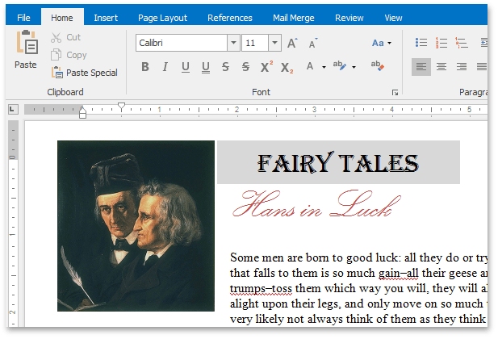

# Rich Text Editor
This section describes the capabilities provided by the **Rich Text Editor**.

&nbsp;

**Text Editor UI**
* [Editor Elements](rich-text-editor/text-editor-ui/editor-elements.md)
* [Toolbars](rich-text-editor/text-editor-ui/toolbars.md)
* [Ribbon Interface](rich-text-editor/text-editor-ui/ribbon-interface.md)

&nbsp;

**File Operations**
* [Create a New Document](rich-text-editor/file-operations/create-a-new-document.md)
* [Load a Document](rich-text-editor/file-operations/load-a-document.md)
* [Save a Document](rich-text-editor/file-operations/save-a-document.md)
* [Print a Document](rich-text-editor/file-operations/print-a-document.md)

&nbsp;

**Document Layout and Page Setup**
* [Divide a Documents into Sections](rich-text-editor/document-layout-and-page-setup/divide-a-documents-into-sections.md)
* [Adjust Page Settings](rich-text-editor/document-layout-and-page-setup/adjust-page-settings.md)
* [Lay Out Text in Columns](rich-text-editor/document-layout-and-page-setup/lay-out-text-in-columns.md)
* [Add Line Numbers](rich-text-editor/document-layout-and-page-setup/add-line-numbers.md)
* [Change Page Background Color](rich-text-editor/document-layout-and-page-setup/change-page-background-color.md)

&nbsp;

**Viewing and Navigating**
* [Navigate through a Document](rich-text-editor/viewing-and-navigating/navigate-through-a-document.md)
* [Switch Document Views](rich-text-editor/viewing-and-navigating/switch-document-views.md)
* [Zoom a Document](rich-text-editor/viewing-and-navigating/zoom-a-document.md)

&nbsp;

**Text Editing**
* [Select Text](rich-text-editor/text-editing/select-text.md)
* [Delete Text](rich-text-editor/text-editing/delete-text.md)
* [Find and Replace Text](rich-text-editor/text-editing/find-and-replace-text.md)
* [Use a Clipboard](rich-text-editor/text-editing/use-a-clipboard.md)
* [Check Text Spelling](rich-text-editor/text-editing/check-text-spelling.md)
* [Undo and Redo Last Operations](rich-text-editor/text-editing/undo-and-redo-last-operations.md)

&nbsp;

**Formatting**
* [Format Text](rich-text-editor/formatting/format-text.md)
* [Format Paragraphs](rich-text-editor/formatting/format-paragraphs.md)
* [Apply and Modify Styles](rich-text-editor/formatting/apply-and-modify-styles.md)

&nbsp;

**Pictures and Text Boxes**
* [Insert a Picture](rich-text-editor/pictures-and-text-boxes/insert-a-picture.md)
* [Insert, Select, Copy or Delete a Text Box](rich-text-editor/pictures-and-text-boxes/insert-select-copy-or-delete-a-text-box.md)
* [Add, Change or Delete a Border for a Picture or Text Box](rich-text-editor/pictures-and-text-boxes/add-change-or-delete-a-border-for-a-picture-or-text-box.md)
* [Add, Change or Delete a Text Box Fill](rich-text-editor/pictures-and-text-boxes/add-change-or-delete-a-text-box-fill.md)
* [Rotate a Picture or Text Box](rich-text-editor/pictures-and-text-boxes/rotate-a-picture-or-text-box.md)
* [Move a Picture or Text Box](rich-text-editor/pictures-and-text-boxes/move-a-picture-or-text-box.md)
* [Wrap Text around a Picture or Text Box](rich-text-editor/pictures-and-text-boxes/wrap-text-around-a-picture-or-text-box.md)
* [Resize a Picture or Text Box](rich-text-editor/pictures-and-text-boxes/resize-a-picture-or-text-box.md)

&nbsp;

**Lists**
* [Numbered Lists](rich-text-editor/lists/numbered-lists.md)
* [Bulleted Lists](rich-text-editor/lists/bulleted-lists.md)
* [Multilevel Lists](rich-text-editor/lists/multilevel-lists.md)

&nbsp;

**Tables**
* [Insert a Table](rich-text-editor/tables/insert-a-table.md)
* [Add and Remove Table Borders](rich-text-editor/tables/add-and-remove-table-borders.md)
* [Customize a Style of Cell Borders](rich-text-editor/tables/customize-a-style-of-cell-borders.md)
* [Select a Cell, Row or Column](rich-text-editor/tables/select-a-cell-row-or-column.md)
* [Insert a Cell, Row or Column](rich-text-editor/tables/insert-a-cell-row-or-column.md)
* [Delete a Cell, Row or Column](rich-text-editor/tables/delete-a-cell-row-or-column.md)
* [Merge or Split Cells](rich-text-editor/tables/merge-or-split-cells.md)
* [Align Text in Table Cells](rich-text-editor/tables/align-text-in-table-cells.md)
* [Set Background Color of Cells](rich-text-editor/tables/set-background-color-of-cells.md)

&nbsp;

**Header and Footer**
* [Header and Footer](rich-text-editor/header-and-footer.md)

&nbsp;

**Embedding Fields (Mail Merge)**
* [Mail Merge](rich-text-editor/mail-merge.md)

&nbsp;

**Table of Contents**
* [Create a Table of Contents](rich-text-editor/table-of-contents/create-a-table-of-contents.md)
* [Create Table of Contents for Special Cases](rich-text-editor/table-of-contents/create-table-of-contents-for-special-cases.md)
* [Update Table of Contents](rich-text-editor/table-of-contents/update-table-of-contents.md)

&nbsp;

**Document Protection**
* [Protect and Unprotect a Document](rich-text-editor/document-protection/protect-and-unprotect-a-document.md)
* [Edit a Protected Document](rich-text-editor/document-protection/edit-a-protected-document.md)

&nbsp;

**Miscellaneous**
* [Insert a Bookmark](rich-text-editor/miscellaneous/insert-a-bookmark.md)
* [Insert a Hyperlink](rich-text-editor/miscellaneous/insert-a-hyperlink.md)
* [Insert a Comment](rich-text-editor/miscellaneous/insert-a-comment.md)
* [Insert a Page Break](rich-text-editor/miscellaneous/insert-a-page-break.md)
* [Insert Page Numbers](rich-text-editor/miscellaneous/insert-page-numbers.md)
* [Insert a Symbol](rich-text-editor/miscellaneous/insert-a-symbol.md)
* [Set Document Properties](rich-text-editor/miscellaneous/set-document-properties.md)