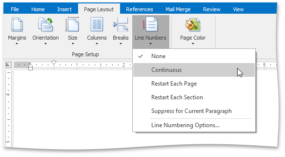
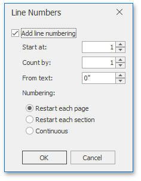

1. To add line numbers to a whole document, [select the entire document](../../../../interface-elements-for-desktop/articles/rich-text-editor/text-editing/select-text.md) if your document is divided into multiple [sections](../../../../interface-elements-for-desktop/articles/rich-text-editor/document-layout-and-page-setup/divide-a-documents-into-sections.md). If your document consists of one section only, simply click anywhere within a document.
	
	To add line numbers to a particular section or multiple sections, click a section or select multiple sections.
2. On the **Page Layout** [ tab](../../../../interface-elements-for-desktop/articles/rich-text-editor/text-editor-ui/ribbon-interface.md), in the **Page Setup** group, click **Line Numbers** and select one of the available line numbering types from the invoked list...
	
	
	
	...or click **Line Numbering Options** to invoke the **Line Numbers** dialog that you can use to adjust line numbering options in a more flexible way (specify the value to be used for the first line - **Start at**, increment value for line numbering - **Count by**, distance between line number and the start of the text line - **From text**).
	
	