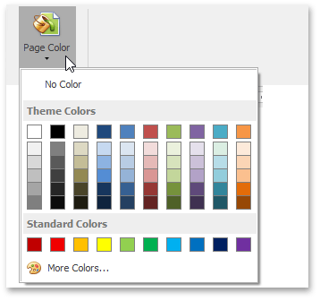

# Change Page Background Color
On the **Page Layout** [ tab](../text-editor-ui/ribbon-interface.md), in the **Background** group, click **Page Color** and select the required color for the background of the document pages.

