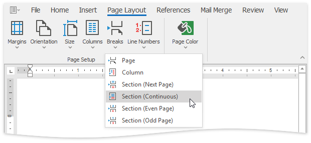
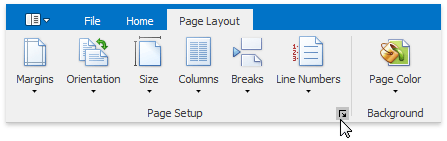
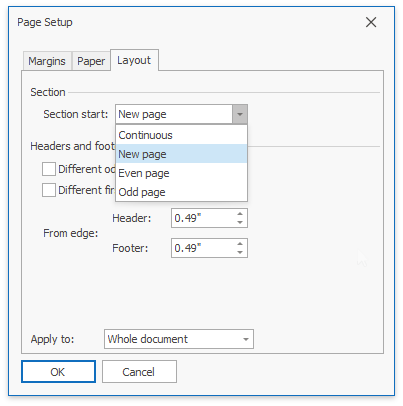

# Divide a Documents into Sections
You can divide your document into sections to specify parts of a document that have different [page settings](adjust-page-settings.md) (page margins, page orientation, paper size), [column layouts](lay-out-text-in-columns.md), [line numbering](add-line-numbers.md) and [headers and footers](../header-and-footer.md).

## Insert Section Breaks
To divide a document into sections, insert section breaks.
1. Click where you want to inset a section break within a document.
2. On the **Page Layout** [ tab](../text-editor-ui/ribbon-interface.md), in the **Page Setup** group, click the **Breaks** button and select one of the following types of section breaks.
	
	
	* **Next Page** - inserts a section break and starts a new section on the next page.
	* **Even Page** - inserts a section break and starts a new section on the next even-numbered page.
	* **Odd Page** - inserts a section break and starts a new section on the next odd-numbered page.

To show the section break mark, press **CTRL+SHIFT+8** or on the **Home** [ tab](../text-editor-ui/ribbon-interface.md), in the **Paragraph** group, click the **Show/Hide Parapragh** button.

In a document, section breaks are marked as illustrated below.

## Change Section Break Type
You can change the type of the section break that has been inserted to start a section. To do this, follow the instructions below.
1. Click the section following the section break that you wish to change.
2. Invoke the **Page Setup** dialog by clicking the dialog box launcher.
	
	
3. Сhange the **Section start** property on the **Layout** tab as required.
	
	