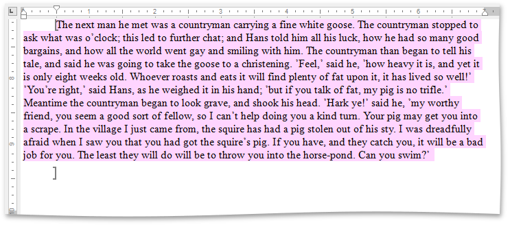

# Edit a Protected Document
When a document is protected, it is read-only except for specific unrestricted parts. You can modify a document part if you have been given permission to make changes to this part. Editable document regions can be easily recognized - they are highlighted and enclosed in brackets.

