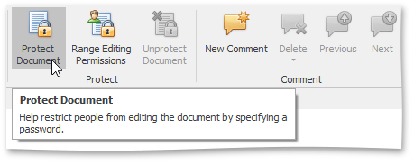
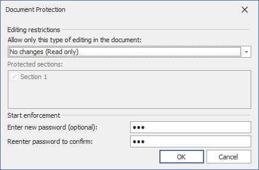
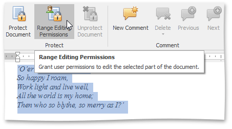
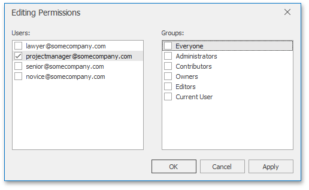
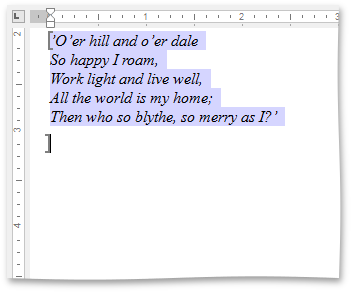
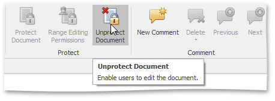
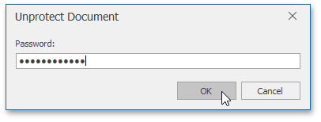

# Protect and Unprotect a Document
## <a name="protectdocument"/>Add Protection to a Document
To protect a document by specifying a password, follow the steps below.
1. On the **Review** [tab](../text-editor-ui/ribbon-interface.md), in the **Protect** group, click the **Protect Document** button .
	
	
2. In the invoked **Start Enforcing Protection** dialog, specify a password to restrict people from editing a document. To do this, type a password in the **Enter new password (optional)** box and confirm it in the **Reenter password to confirm** box.
	
	

You can also [allow particular users to change certain parts of a document](#giveuserspermissiontoeditcertainparts).

## <a name="giveuserspermissiontoeditcertainparts"/>Give Users Permission to Edit Certain Parts of a Document
Before [adding protection](#protectdocument) to a document, you can specify certain parts of the document where you want to remove the restriction and allow a particular user or group of users to modify these parts.
1. [Select a part of a document](../text-editing/select-text.md) to be unrestricted.
2. On the **Review** [tab](../text-editor-ui/ribbon-interface.md), in the **Protect** group, click the **Range Editing Permissions** button.
	
	
3. In the invoked **Editing Permissions** dialog, select a user or group of users to be allowed to edit the selected part of a document.
	
	
4. Editable ranges will be highlighted and enclosed in brackets.
	
	
5. Continue to select the document regions and give users permission to edit them.
6. After specifying all required unrestricted parts of a document, [add protection](#protectdocument).

## Remove Protection from a Document
You can unprotect a document, if you know the password for removing document protection.
1. On the **Review** [tab](../text-editor-ui/ribbon-interface.md), in the **Protect** group, click the **Unprotect Document** button.
	
	
2. In the invoked **Unprotect Document** dialog, type the password.
	
	