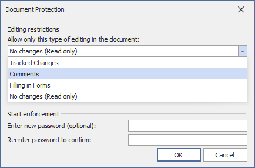

# Protect and Unprotect a Document

## Protect a Document

Follow the steps below to protect a document with a password.

1. On the **Review** [tab](../text-editor-ui/ribbon-interface.md), in the **Protect** group, click the **Protect Document** button.

    
2. Specify a protection type in the invoked **Document Protection** dialog. Select **No changes (Read-only)** to restrict all actions, **Comments** - to allow leaving comments only, **Tracked Changes** - to prevent other users from creating untracked changes.

    

3. Type a password in the **Enter new password (optional)** box and confirm it in the **Reenter password to confirm** box.

    

You can also [allow particular users to change certain parts of a document](#give-users-permission-to-edit-certain-document-parts).

## Give Users Permission to Edit Certain Document Parts

Before [adding protection](#protect-a-document) to a document, you can specify certain parts of the document where you want to remove the restriction and allow a particular user or group of users to modify these parts.

1. [Select a part of a document](../text-editing/select-text.md) to be available.
2. On the **Review** [tab](../text-editor-ui/ribbon-interface.md), in the **Protect** group, click the **Range Editing Permissions** button.

    
3. In the invoked **Editing Permissions** dialog, select a user or group of users to be allowed to edit the selected part of a document.

    
4. Editable ranges will be highlighted and enclosed in brackets.

    
5. Continue to select the document regions and give users permission to edit them.
6. After specifying all required parts, [enable protection](#protect-a-document).

## Remove Protection from a Document

1. On the **Review** [tab](../text-editor-ui/ribbon-interface.md), in the **Protect** group, click the **Unprotect Document** button.

    
2. In the invoked **Unprotect Document** dialog, type the password.

    
