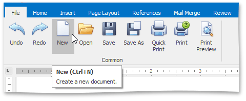

# Create a New Document
To create a new empty document, on the **File** [ tab](../text-editor-ui/ribbon-interface.md), in the **Common** group, use the **New** button, or the **CTRL+N** keyboard shortcut.

