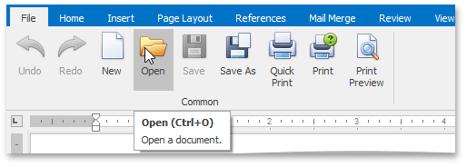
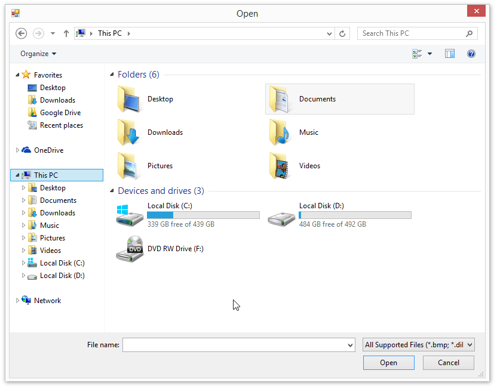

# Load a Document
To load a document, on the **File** tab, in the **Common** group, click the **Open** button, or use the **CTRL+O** keyboard shortcut.

The **Open** dialog appears, allowing you to select a file.

The **Rich Editor** enables you to open documents of the following types:
* Rich Text Format (*.rtf)
* Text Files format (*.txt)
* Hyper Text Markup Language format (*.htm, *.html)
* web page archive format (*.mht)
* Microsoft Word 97-2003 format (*.doc)
* WordML (*.xml)
* Open Office XML format (aka Office 2007 or *.docx)
* Open Document Format (*.odt)
* Electronic Publication (*.epub)