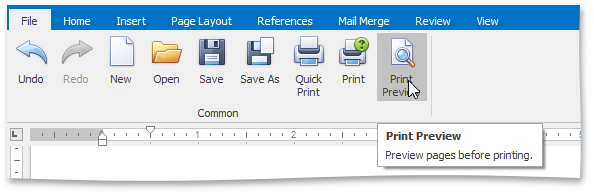
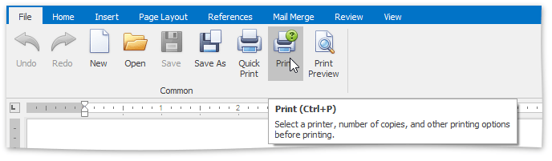
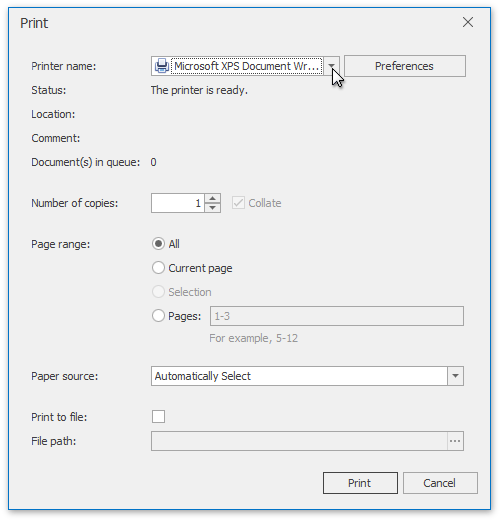
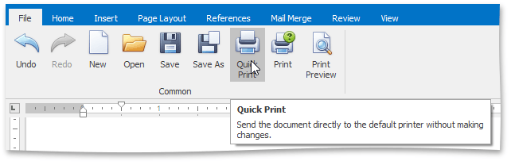

# Print a Document
## Preview a Document Before Printing
To display the document as it will look when printed, on the **File** [ tab](../text-editor-ui/ribbon-interface.md), in the **Common** group, click the **Print Preview** button.

## Print a Document
1. On the **File** [ tab](../text-editor-ui/ribbon-interface.md), in the **Common** group, click the **Print** button...
	
	
	
	...or press **CTRL+P**.
	
	The **Print** dialog will be invoked.
	
	
2. In the **Print** dialog, specify all required settings and click **Print**.

## Print a Document Using Default Settings
To send a document directly to the default printer without customizing print settings, on the **File** [ tab](../text-editor-ui/ribbon-interface.md), in the **Common** group, click the **Quick Print** button.

