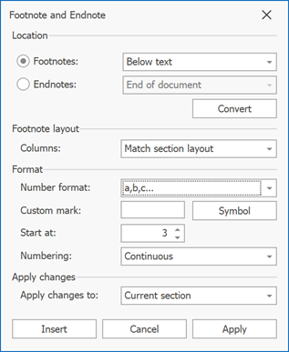
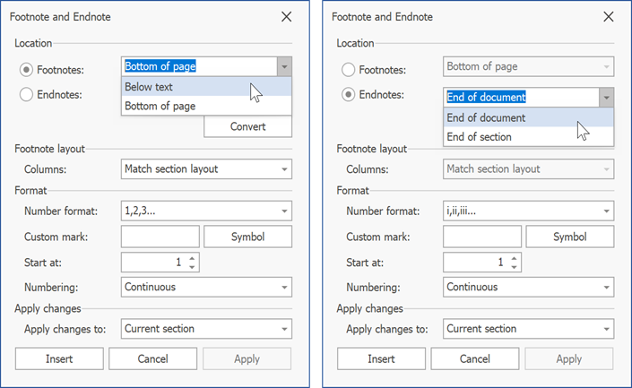
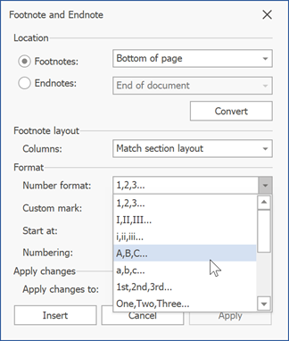
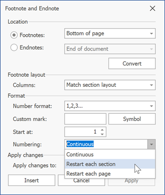

# Change Note Appearance

Click the **Footnotes** dialog box launcher on the **References** tab or right-click a note and select **Note Options**.

This invokes the **Footnote and Endnote dialog**. Options in this dialog allow you to specify note location, layout, and format.

To specify what note options to change, click the **Footnotes** or **Endnotes** radio button in the dialog's **Location** section.

You can apply changes to the current section or to the whole document. Select the required options in the **Apply changes to:** drop-down list.

## Change Note Location

Select the desired note location from the **Location** drop-down menu. You can place footnotes at the bottom of the page or below text. Endnotes can be located at the end of the document or at the end of each section.

## Change Note Layout

Select the number of columns in the **Columns:** list.

> This parameter is ignored. You can set this option and save its value to a file for further processing in Microsoft Word or other word processing applications.

## Change Note Format

The **Format** section allows you to specify the following options:

* **Number Format** - Specifies how to format numbers in footnote or endnote references. Select the desired format from the drop-down list.

    
* **Custom Mark** - Specifies the symbol used to mark a footnote or endnote reference. You can paste a symbol to the **Custom mark** field or click **Symbol** to select a symbol from the **Symbol** dialog.
    image
* **Start At** - Specifies the start number for a footnote or endnote reference. Enter the number in the **Start At** field. If you set the **Numbering** option to **Restart each section** or **Restart each page**, the **Start At** option value is ignored.

* **Numbering** - Specifies when reference numbering should be reset. If you set this option to **Restart each section** or **Restart each page** and then change the **Start At** option, the **Numbering** value is reset to **Continuous**.

    
