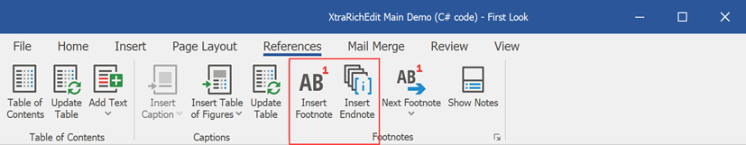
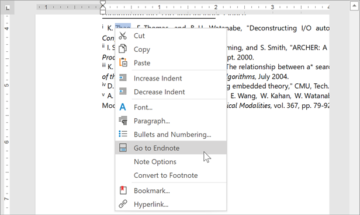
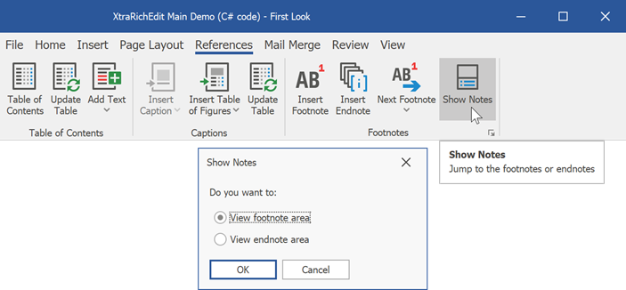
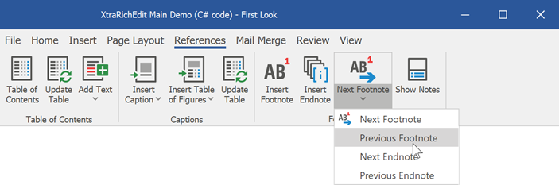
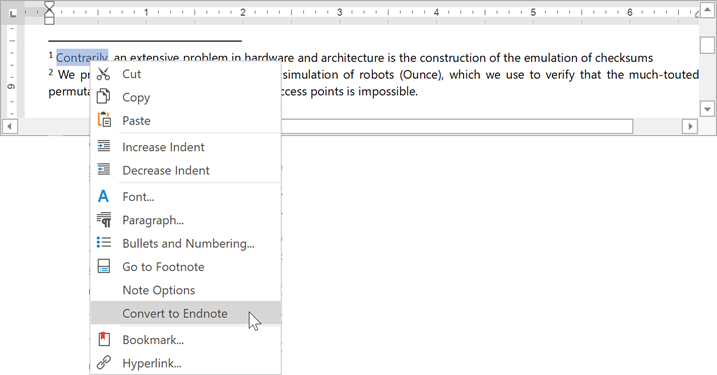
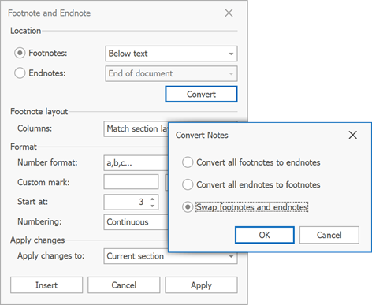

# Insert and Edit a Footnote or an Endnote

* Place the cursor at the required position.

* Click the **Insert Footnote** or **Insert Endnote** button in the **Footnotes** group on the **References** tab.

    
* Enter the footnote or endnote text. The note content can be formatted as regular text.
* Right-click a note and select **Go to Footnote** or **Go to Endnote** to find the note reference position.

    

## View Notes

To display notes, click **Show Notes** in the **Footnotes** group on the **References** tab and select the required area.

Use buttons on the **References** tab to navigate through footnotes or endnotes.

## Convert Footnotes to Endnotes and Vice Versa

Place the cursor within the target footnote or endnote. Right-click the note and select **Convert to Endnote** or **Convert to Footnote**.

You can convert all footnotes to endnotes and vice versa. Click the **Footnotes** dialog box launcher on the **References** tab.

In the **Footnotes** dialog, click the **Convert** button. This invokes the **Convert Notes** dialog. Select the required option to convert or swap notes.

## Remove a Footnote or Endnote

Delete the note reference to remove a footnote or endnote. Right-click the note and click **Go to Footnote** or **Go to Endnote** to locate the reference.

