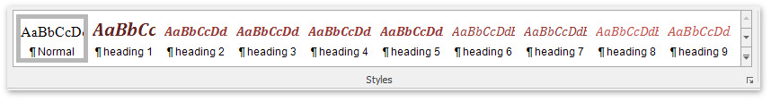
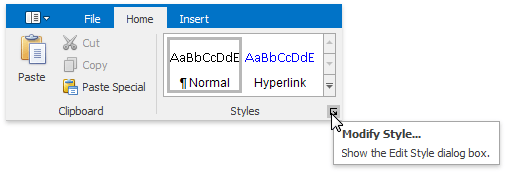
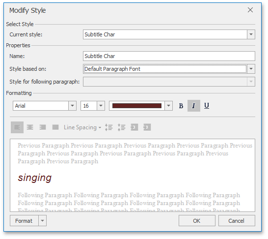

# Apply and Modify Styles
To format a text or a paragraph you can apply styles. A style is a group of formatting characteristics. All these characteristics are applied to a text or a paragraph at once when you apply a style. Thus, styles allow you to change text and paragraph appearance quicker than setting all formatting characteristics separately ([Format Text](format-text.md), [Format Paragraphs](format-paragraphs.md)).

A **character based style** includes characteristics to format text within a paragraph (e.g., font type and size,  bold and italic formats, etc.)

A **paragraph based style** affects paragraph formatting characteristics such as text alignment, line spacing, etc. It can also include character formatting characteristics.

## Apply a Style
To apply a style, do the following.
1. [Select text](../text-editing/select-text.md) or a paragraph that you want to format.
2. On the **Home** [ tab](../text-editor-ui/ribbon-interface.md), in the **Styles** group, click or type a required style name in the **Quick Styles** box .
	
	

## Modify a Style
You can modify an existing style via the **Modify Style** dialog.

To invoke the dialog, do the following:
1. On the **Home** [ tab](../text-editor-ui/ribbon-interface.md), in the **Styles** group, click the **Modify Style** button:
	
	
2. The **Modify Style** dialog enables you to change the base style for the current style (to specify how the styles cascade), the style which should be used for the following paragraph, and basic characteristics of the style, such as Font, Paragraph and Tab Stops.
	
	