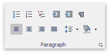
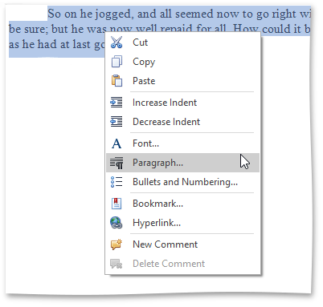
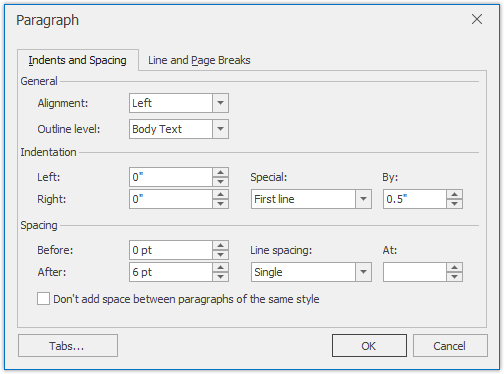

# Format Paragraphs
To format a paragraph, first click anywhere within it or [select](../text-editing/select-text.md) the paragraph, and then use the **Paragraph** page group on the **Home** [ tab](../text-editor-ui/ribbon-interface.md) to change line spacing, indentation, alignment and styles.

Also, you can use the **Paragraph** dialog to format the paragraph. To invoke this dialog, right-click the paragraph and select the **Paragraph** item from the context menu.

The **Paragraph** dialog appears, as illustrated below.

In this dialog, you can change different parameters for the paragraph (Indents and Spacing tab) and pagination (Line and Page Breaks tab).

The **Rich Editor** provides a list of the default keyboard shortcuts to format paragraphs.

|  |  |
|---|---|
| CTRL+1 | Formats a current paragraph with single line spacing. |
| CTRL+2 | Formats a current paragraph with double line spacing. |
| CTRL+5 | Formats a current paragraph with one and a half line spacing. |
| CTRL+E | Toggles centered paragraph alignment on and off. |
| CTRL+J | Toggles justified paragraph alignment on and off. |
| CTRL+L | Toggles left paragraph alignment on and off. |
| CTRL+R | Toggles right paragraph alignment on and off. |