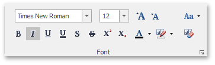
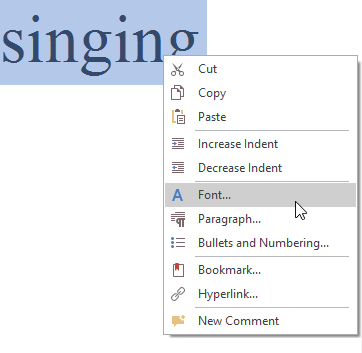
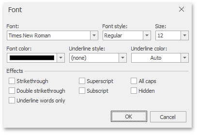

# Format Text
To format text, first [select it](../text-editing/select-text.md) and then use the **Font** page group on the **Home** [ tab](../text-editor-ui/ribbon-interface.md) to change the font family, size, color, etc.

Also, you can modify the font using the **Font** dialog. Select the text that you want to format, right-click it and choose the **Font** item from the context menu.

The **Font** dialog appears as illustrated below.

In this dialog, you can specify all required font parameters, and apply them to the selected text.

In addition, the **Rich Editor** provides a list of default keyboard shortcuts for text formatting:

|  |  |
|---|---|
| CTRL+B | Toggles the bold style on the selection. |
| CTRL+I | Toggles the italic style on the selection. |
| CTRL+U | Toggles the underline style on the selection. |
| CTRL+D | Invokes the **Font** dialog that allows you to change the font, size and style of the selected text. |
| CTRL+PLUS | Toggles the subscript style on the selection. |
| CTRL+CLOSEBRACKETS (]) | Increases the font size of the selected text by one point. |
| CTRL+OPENBRACKETS ([) | Decreases the font size of the selection by one point. |
| CTRL+SHIFT+PERIOD | Increases the font size of the selection to the closest larger predefined value. |
| CTRL+SHIFT+COMMA | Decreases the font size of the selection to the closest smaller predefined value. |
| CTRL+SHIFT+D | Toggles the double underline style on the selection. |
| CTRL+SHIFT+PLUS | Toggles the superscript style on the selection. |
| CTRL+SHIFT+H | Toggles between the normal and hidden text mode for the selection. To view the hidden text, press CTRL+SHIFT+8. |
| CTRL+SPACE | Clears formatting of selected text - resets it to default. |