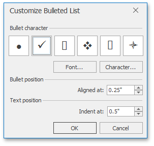

# Bulleted Lists
## Create a Bulleted List as You Type
1. Point to the position in a document from where you want to begin your list.
2. On the **Home** [ tab](../../../../interface-elements-for-desktop/articles/rich-text-editor/text-editor-ui/ribbon-interface.md), in the **Paragraph** group, click the **Bullets**  button .
	
	
3. Type the text.
4. Press **ENTER** to create the next item of the list.
5. To finish the list, press **ENTER** twice.

## Make a Bulleted List from the Selected Text
You can add bullets to existing lines of text in two ways. The first method is to use the **Home** ribbon tab:
1. Select the text lines that you want to transform into a list.
2. On the **Home** [ tab](../../../../interface-elements-for-desktop/articles/rich-text-editor/text-editor-ui/ribbon-interface.md), in the **Paragraph** group, click the **Bullets** button.

Another way to do the same thing is to use the [context menu](../../../../interface-elements-for-desktop/articles/rich-text-editor/text-editor-ui/editor-elements.md):
1. Select the text to be transformed into a list.
2. Right-click within the document and select the **Bullets and Numbering** item from the invoked context menu.
	
	
3. In the invoked **Bullets and Numbering** dialog, click the **Bulleted** tab and choose the list style that you want to apply.
	
	

## Create Your Own List Style
You can create your own style for a bulleted list on the basis of one of the existing list styles, by changing various list parameters.
1. Select the bulleted list (or text to be transformed into the bulleted list) to which you want to apply your own style.
2. Right-click within the document and select the **Bullets and Numbering** item from the resulting [context menu](../../../../interface-elements-for-desktop/articles/rich-text-editor/text-editor-ui/editor-elements.md). The **Bullets and Numbering** dialog will be displayed.
	
	
3. Click the **Bulleted** tab, choose one of the existing styles and click **Customize...**. The **Customize Bulleted List** dialog will be invoked.
	
	
	
	> The **Customize...** button is disabled if the **None** item of the **Bullets and Numbering** dialog is selected.
4. In this dialog, change different list parameters to create your own list style.
	 
	
	For instance, if you specify list parameters in the following way,...
	
	
	
	...you will get the list style as illustrated below.
	
	