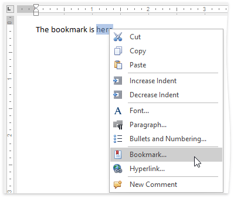

 

A **Bookmark** exposes a document range with a name. The range can have a zero length. The name should start with a letter and can include numbers.

To create a new bookmark, place the caret at the chosen location, or select the text to mark, and on the **Insert** tab, in the **Links** group, click the **Bookmark** button...

...or choose the **Bookmark...** item from the context menu.

In the invoked **Bookmark** dialog, specify the bookmark name and click **Add**.

After you insert a bookmark in a document, you can [insert a hyperlink](../../../../interface-elements-for-desktop/articles/rich-text-editor/miscellaneous/insert-a-hyperlink.md) to make a cross-reference to this bookmark.