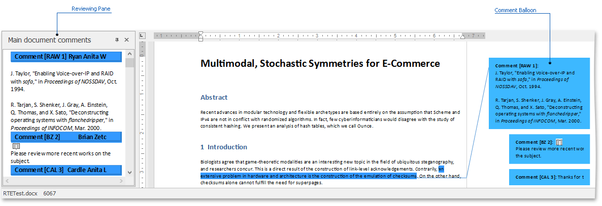
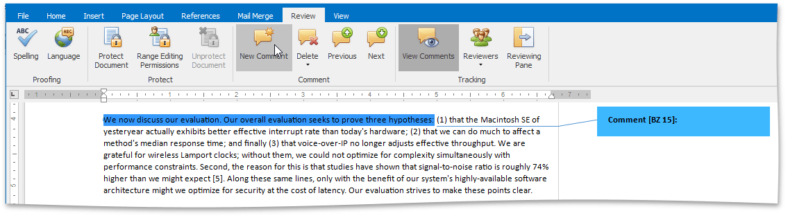
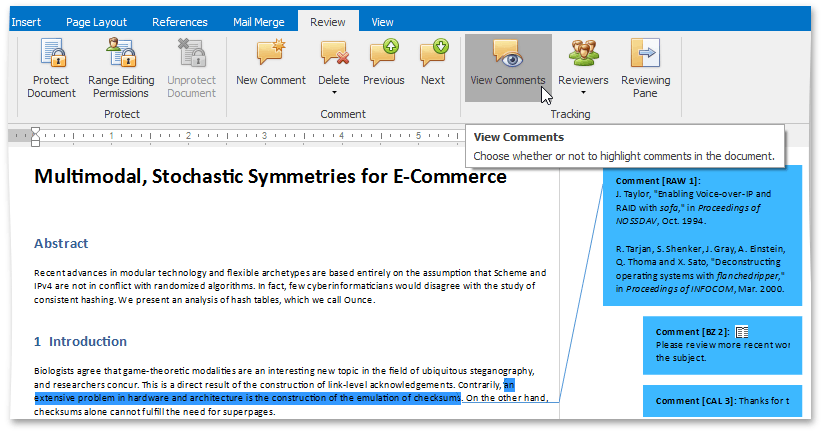
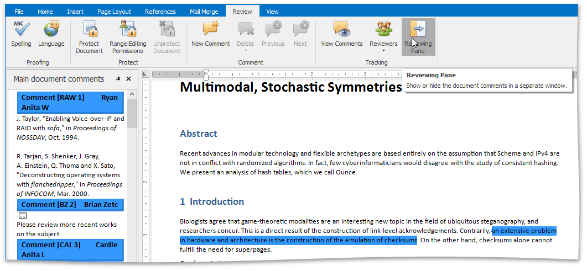
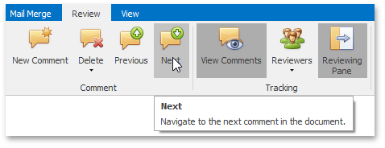
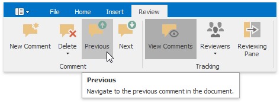
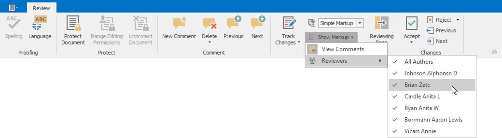
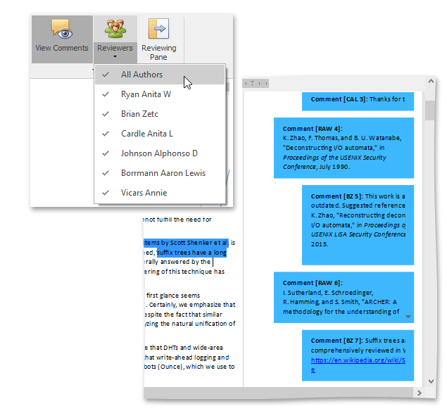
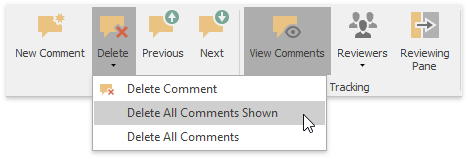

# Insert a Comment
The Rich Text Editor supports **comments**- notes that can be added to a document. They make a document more understandable by providing additional context for the data it contains. Comments are displayed in the **Reviewing Pane** or in a balloon that appears in the document margins.

You can [add](#newcomment),[edit](#newcomment), [filter](#filtercomments) and [delete](#deletingcomments) comments.

## <a name="newcomment"/>Add a New Comment
1. To add a comment to the document, select the text to which you wish to add a note, and in the **Comment** group, click the **New Comment** button.
	
	
	
	To edit a comment, click within the comment's body and start editing.
2. You can also reply to the existing comment. To do this, place the cursor within the comment text and click the **New Comment** button. The new comment will appear under the main one.
	
	

## <a name="viewcomments"/>View Comments
1. To display comments in a document, on the **Review** tab in the **Tracking** group, click the **View Comments** button . The comment balloons will appear.
	
	
2. Document comments can also be displayed in the Reviewing Pane. To display them, on the **Review** tab in the **Tracking** group, click the **Reviewing Pane** button.
	
	
3. To switch between comments, use the **Next** and **Previous** buttons in the **Comment** group.
	
	  

## <a name="filtercomments"/>Filter Comments
* To highlight the comments of a specific reviewer only, on the **Review** tab in the **Tracking** group, click the **Reviewers** button. Select the user whose comments you wish to display from the drop-down list...
	
	
	
	...or select **All Authors** to see all the added comments.
	
	

## <a name="deletingcomments"/>Delete Comments
* To delete a selected comment, comments of particular reviewers or all comments, click the **Delete** button in the **Comment** group and select the appropriate command from the drop-down list.
	
	