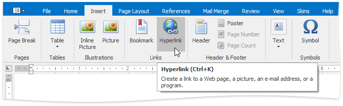
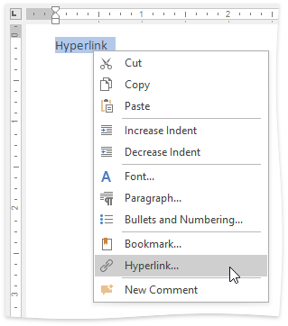
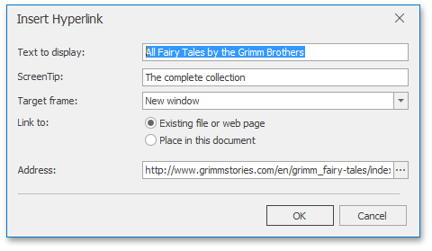

# Insert a Hyperlink
The **Hyperlink** marks the document range as a hot spot in the document. It can be activated by clicking or pressing **ENTER**, to navigate the specified external URL, file or [bookmark](insert-a-bookmark.md) within the same document.

To create a new hyperlink, select a range to mark and on the **Insert** tab, in the **Links** group, click the **Hyperlink** button...

...or select the **Hyperlink...** item from the context menu ...

... or use the **CTRL+K** keyboard shortcut.

The **Edit hyperlink** dialog will appear.

