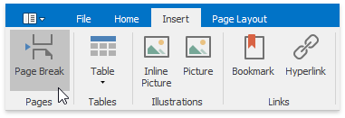
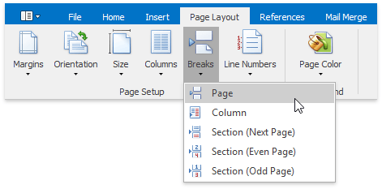
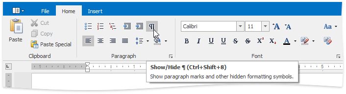
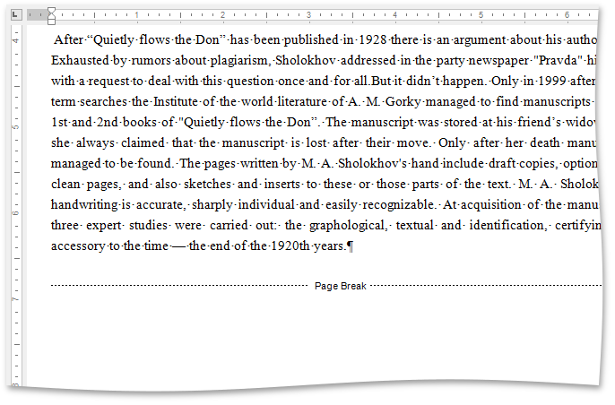

# Insert a Page Break
## Insert Page Break
You can insert a page break in your document anywhere you want. To do this, follow the steps below.
1. Point to the position within a document where you want to insert a page break.
2. On the **Insert** tab, in the **Pages** group, click the **Page break** button ...
	
	
	
	... or on the **Page Layout** tab, in the **Page Setup** group, click the **Breaks** button and select **Page** from the invoked list...
	
	
	
	... or press **CTRL+ENTER**.

To show the page break mark, press **CTRL+SHIFT+8** or on the **Home** tab, in the **Paragraph** group, click the **Show/Hide** button.

In a document, page breaks are marked as illustrated below.

## Keyboard Shortcuts to Insert Breaks
You can use the following keyboard shortcuts to insert breaks of different types:

| Shortcut | Description |
|---|---|
| CTRL+SHIFT+ENTER | Inserts a [column break](../document-layout-and-page-setup/lay-out-text-in-columns.md) in a document. |
| CTRL+SHIFT+SPACE | Inserts a non-breaking space. |
| CTRL+ENTER | Inserts a page break. |
| ENTER | Inserts a paragraph break. |
| SHIFT+ENTER | Inserts a line break. |
| TAB | Inserts a tab |