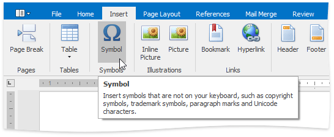

# Insert a Symbol
The **Rich Text Editor** allows you to insert symbols that are not on your keyboard, such as copyright symbols, trademark symbols, paragraph marks.

To insert a symbol, do the following:
1. Point to the position within the document where you want to insert a symbol.
2. On the **Insert** [tab](../text-editor-ui/ribbon-interface.md), in the **Symbol** group, click the **Symbol** button.
	
	
	
	The **Symbol** dialog will be invoked.
	
	
3. Select the symbol to be inserted and click **OK**, or double-click the symbol.

In addition, some symbols can be inserted in the document using default keyboard shortcuts:

| Shortcut | Description |
|---|---|
| CTRL+ALT+C | Inserts the copyright (**&#169;**) symbol. |
| CTRL+ALT+OEMPERIOD | Inserts the ellipsis (**&#8230;**) symbol. |
| CTRL+ALT+R | Inserts the registered trademark (**&#174;**) symbol. |
| CTRL+ALT+- | Inserts the em dash (**&#8212;**) symbol. |
| CTRL+ALT+T | Inserts the trademark sign (**&#8482;**) symbol. |
| CTRL+- | Inserts the en dash (-) symbol. |