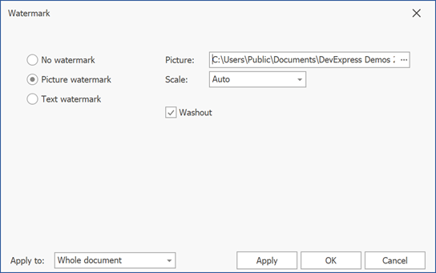
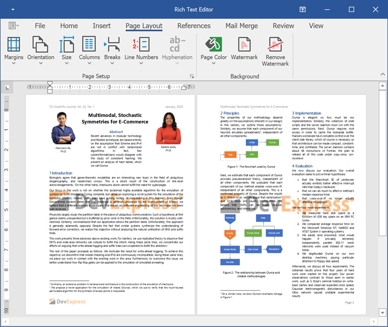
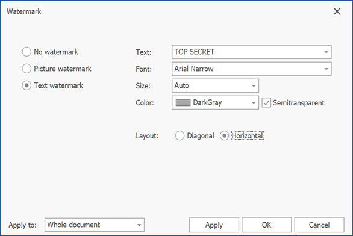
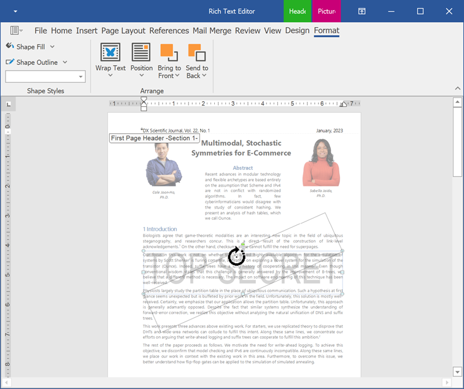
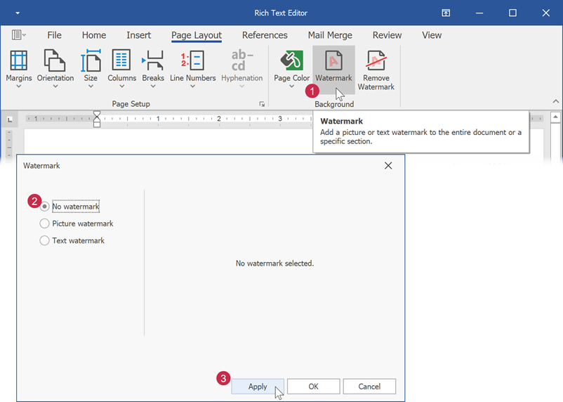

# Insert a Watermark

A watermark is a faded background image or text displayed behind document content. The WinForms Rich Text Editor allows you to create and remove watermarks. You can also print and export documents with watermarks to PDF.

## Insert an Picture Watermark

Click **Watermark** on the **Page Layout** tab to invoke the **Watermarks** dialog.

In the invoked dialog, select **Picture Watermark** and specify the path to a picture. You can also change the scale percentage and apply or remove the washout effect.

Use the **Apply to** box to specify whether to add a watermark to all document pages or to the current section only.

The image below illustrates the result:

## Insert a Text Watermark

Click **Watermark** on the **Page Layout** tab to invoke the **Watermarks** dialog.

In the invoked dialog, select **Text Watermark**. Specify the watermark text. You can enter the required text or select one of the predefined phrases from a list. You can also configure text options (font attributes, text color, and layout).

Use the **Apply to** box to specify whether to add a watermark to all document pages or to the current section only.

The image below illustrates the result:

## Edit a Watermark

Click **Watermark** on the **Page Layout** tab to invoke the **Watermarks** dialog. Change the required settings and click **Apply**.

A watermark is located at the section header. Double-click the header area and select the watermark. The **Picture Tools | Format** tab becomes available. You can change the picture fill and outline parameters. Use the round arrow that appears over the watermark to change its rotation angle.

## Remove a Watermark

Click **Watermark** on the **Page Layout** tab to invoke the **Watermarks** dialog. Select **No Watermark** to remove the current watermark.

Click **Remove Watermark** on the **Page Layout** tab to remove all watermarks from a document.

