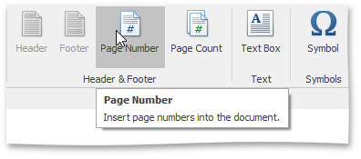
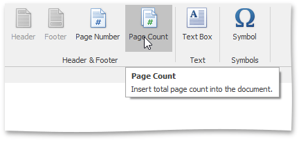

# Insert Page Numbers
## Insert a Page Number
1. On the **Insert** [tab](../../../../interface-elements-for-desktop/articles/rich-text-editor/text-editor-ui/ribbon-interface.md), in the **Header&amp;Footer** group, click the **Header** or **Footer** button . For more information, see [Header and Footer](../../../../interface-elements-for-desktop/articles/rich-text-editor/header-and-footer.md).
	
	 
2. Point to anywhere in the header or footer area where you want to insert the page number.
3. To add page numbers, on the **Insert** tab, in the **Header&amp;Footer** group, click the **Page Number** button.
	
	

## Insert a Page Count
1. On the **Insert** [tab](../../../../interface-elements-for-desktop/articles/rich-text-editor/text-editor-ui/ribbon-interface.md), in the **Header&amp;Footer** group, click the **Header** or **Footer** button. For more information, see [Header and Footer](../../../../interface-elements-for-desktop/articles/rich-text-editor/header-and-footer.md).
	
	 
2. Point to anywhere in the header or footer area where you want to insert the number of pages.
3. To add the number of pages, on the **Insert** tab, in the **Header&amp;Footer** group, click the **Page Count** button.
	
	