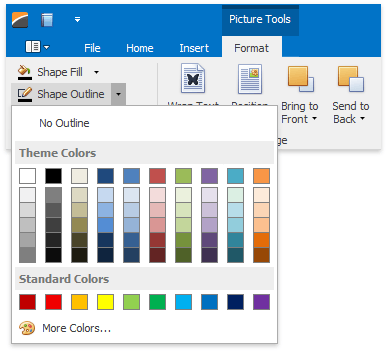
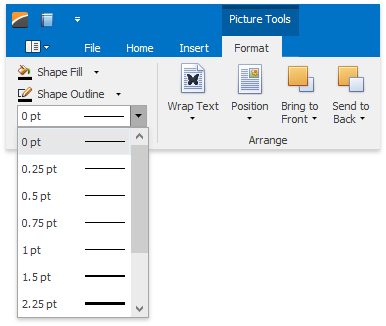
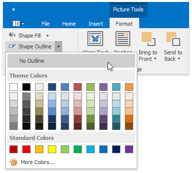

# Add, Change or Delete a Border for a Picture or Text Box
You can specify the [color](#bordercolor) and [weight](#borderweight) of the outside border of a [floating picture](insert-a-picture.md) or [text box](insert-select-copy-or-delete-a-text-box.md), or fully [delete](#removeborder) the border.

## <a name="bordercolor"/>Set the Color of a Picture or Text Box Border
1. Select the [floating picture](insert-a-picture.md) or [text box](insert-select-copy-or-delete-a-text-box.md) whose outline border color you wish to specify.
2. On the **Picture Tools / Format** [ tab](../text-editor-ui/ribbon-interface.md), in the **Shape Styles** group, click **Shape Outline** and select the required color.
	
	

> [!NOTE]
> By default, a floating picture is inserted with [no border](#removeborder). To specify a colored outline border for a picture, a border [weight](#borderweight) must be set.

## <a name="borderweight"/>Set the Weight of a Picture or Text Box Border
1. Select a [floating picture](insert-a-picture.md) or [text box](insert-select-copy-or-delete-a-text-box.md) whose outline border weight you wish to specify.
2. Select the required border weight from the **Shape Outline Weight** list accessed on the **Picture Tools / Format** [ tab](../text-editor-ui/ribbon-interface.md), in the **Shape Styles** group.
	
	

## <a name="removeborder"/>Remove a Picture or Text Box Border
1. Select a [floating picture](insert-a-picture.md) or [text box](insert-select-copy-or-delete-a-text-box.md) whose outline border you wish to remove.
2. On the **Picture Tools / Format** [ tab](../text-editor-ui/ribbon-interface.md), in the **Shape Styles** group, click **Shape Outline** button and select **No Outline**.
	
	