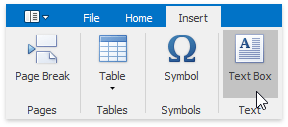
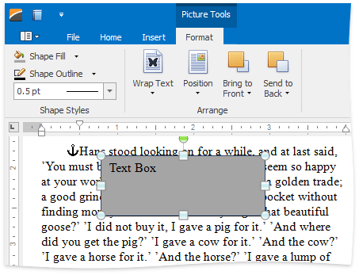
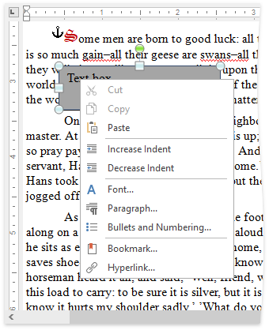
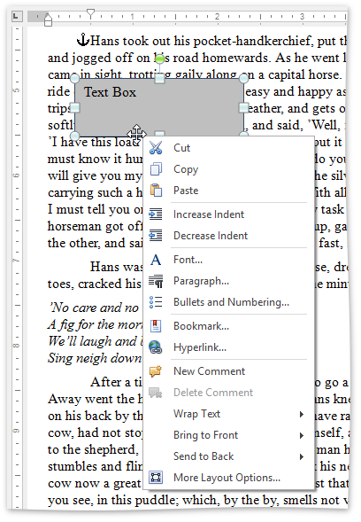

# Insert, Select, Copy or Delete a Text Box
## Insert a Text Box
To insert a text box into your document, position the caret to the desired location and on the **Insert** [ tab](../text-editor-ui/ribbon-interface.md), in the **Text** group, click the **Text Box** button.

A floating text box enables you to specify [fill color](add-change-or-delete-a-text-box-fill.md), [outline width and color](add-change-or-delete-a-border-for-a-picture-or-text-box.md) and apply formatting to the box content.

## <a name="select"/>Select a Text Box
To select a text box, click a border of the text box.

> [!NOTE]
> If the caret is placed inside the text box, you can modify the text box content, but it is impossible to [move](move-a-picture-or-text-box.md), [copy](#copytextbox), [delete](#deletetextbox) the text box or specify such attributes as [fill color](add-change-or-delete-a-text-box-fill.md), [outline color and weight](add-change-or-delete-a-border-for-a-picture-or-text-box.md), [text wrapping](wrap-text-around-a-picture-or-text-box.md), [position](wrap-text-around-a-picture-or-text-box.md), etc. In this case, the text box is not considered as selected, the **Picture Tools / Format** [tab](../text-editor-ui/ribbon-interface.md) and corresponding items of the text box's context menu are unavailable.

## <a name="copytextbox"/>Copy a Text Box
1. [Select](#select) a text box to be copied.
2. On the **Home** [ tab](../text-editor-ui/ribbon-interface.md), in the **Clipboard** group, click **Copy**, or select it from the context menu, or press **CTRL+C**, or press **CTRL+INSERT**.
3. Position the caret to the location where you want to insert the copy of the selected text box.
4. On the **Home** [ tab](../text-editor-ui/ribbon-interface.md), in the **Clipboard** group, click **Paste**, or select it from the context menu, or press **CTRL+V**, or press **SHIFT+INSERT**.

## <a name="deletetextbox"/>Delete a Text Box
1. [Select](#select) a text box that you wish to remove.
2. Press **DELETE**.