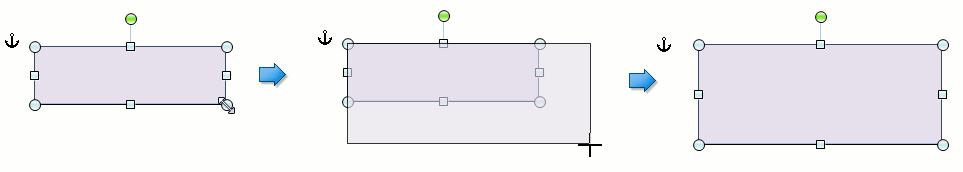
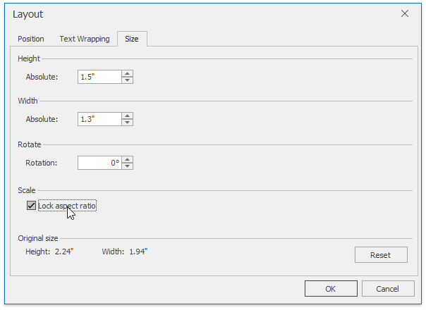

# Resize a Picture or Text Box
To resize a picture or text box, shrink or stretch an object in the following way.
1. Click a [floating picture](insert-a-picture.md) or [text box](insert-select-copy-or-delete-a-text-box.md) to be resized.
2. Drag a _sizing handle_ towards or away from the object center until a required size is reached.
	
	

To keep object proportions when resizing it, check the **Lock aspect ratio** option (it is accessed via the **Layout** dialog that is invoked when selecting the **More Layout Options...** item from the context menu of the floating object). In this case when you change a width of the object by dragging a _corner sizing handle_, the object's height will be automatically changed to maintain exact proportions of the object and vice-versa.

To specify an exact height and width of the object, clear the **Lock aspect ratio** check box.

