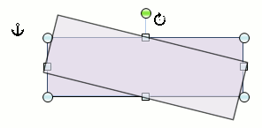
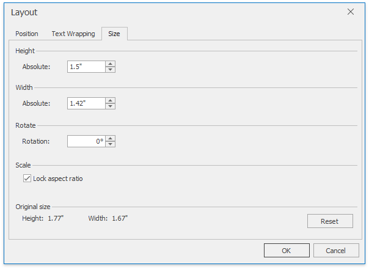

# Rotate a Picture or Text Box
1. Click the [floating picture](insert-a-picture.md) or [text box](insert-select-copy-or-delete-a-text-box.md) that you wish to rotate.
2. Do one of the following.
	* Click the round arrow that appears over the selected floating picture or text box and drag it in the direction to which you wish to rotate the object.
		
		
	* To rotate an object by 15 degree angles, drag the round arrow at the top of the object while holding down the **SHIFT** key.
	* Right-click a picture or text box to be rotated and select the **More Layout Options...** item from the context menu. Switch to the **Size** tab in the invoked **Layout** dialog and set the required value of the angle to rotate the object in the **Rotation** box.
		
		