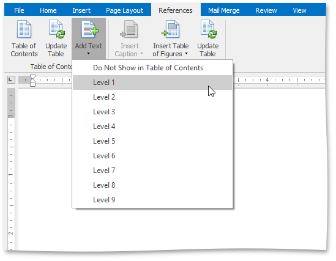
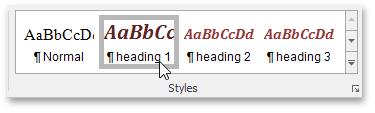
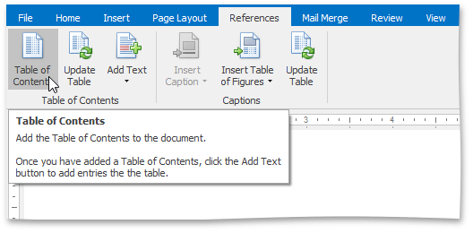
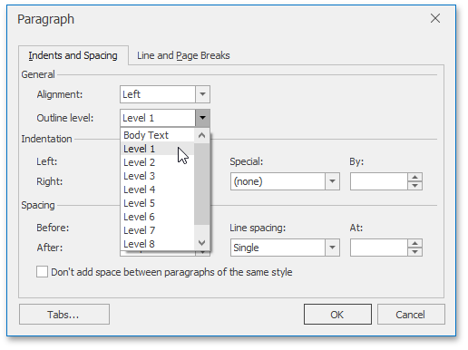
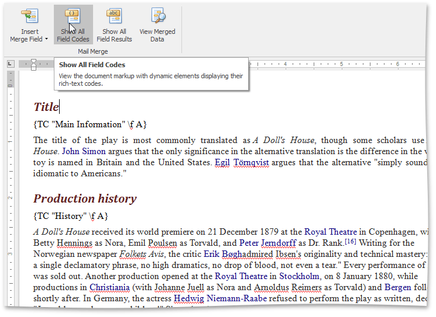

# Create a Table of Contents
## <a name="headingstyles"/>Create a TOC Using Built-In Heading Styles
The easiest way to create a TOC is to use built-in heading styles.
* **Mark TOC Entries**
	1. Select the text (heading) that you want to appear in a TOC.
	2. Click the **Add Text** button on the **References** [tab](../text-editor-ui/ribbon-interface.md) and then select the required level (for example, if you want the selected text to be displayed as the main heading in the TOC, click Level 1, etc.). If you change your mind and decide not to include the selected text in the TOC, click **Do Not Show in Table of Contents**.
		
		
		
		After you have applied levels in a newly created document once or if you have opened a document with specified TOC entires by using heading styles, the corresponding heading styles (Heading 1, Heading 2, etc.) are automatically added to the list of available styles accessed via the **Styles** page group. In this case you can mark TOC entries by choosing these heading styles.
		
		
* **Build a TOC**
	
	After you have specified all required TOC entries, everything is ready to generate a TOC.
	1. Click within the document where you want to insert a TOC.
	2. In the **Table of Contents** group, click **Table of Contents**.
		
		
		
		This will automatically generate a TOC that consists of entries marked by using heading styles.
		
		If you click the **Show All Field Codes** button on the **Mail Merge** toolbar, you will see the TOC field code. By default, it is { TOC \h }. The \h switch inserts all TOC entires as hyperlinks.

## <a name="outlinelevels"/>Create a TOC Using Paragraph Outline Levels
If you wish to include some text in a TOC without changing the text appearance, you can use outline levels. Unlike [heading styles](#headingstyles), outline levels applied to text do not affect text formatting characteristics.
* **Mark TOC Entries**
	1. Select the text that you wish to appear in the TOC.
	2. Right-click the selected text and choose **Paragraph** from the context menu. The **Paragraph** dialog will invoked.
	3. In this dialog, use the **Outline level** combo box to specify the outline level for the selected text. If you change your mind and decide not to include the selected text to the TOC, click **Body Text**.
		
		
* **Build a TOC**
	
	After you have specified all required TOC entries, everything is ready to generate a TOC.
	1. Click within the document where you want to insert a TOC.
	2. Press **CTRL+F9** to create an empty field wherein you can manually enter a field code to insert a TOC.
	3. In this field, write the _{ TOC \u }_ field code. Use the _\u_ switch to include text marked with outline levels in the TOC.
	4. To show the result TOC, place the cursor in the TOC field, right-click it and select the **Update Field** item from the context menu, or click the **Update Table** button on the **References** [tab](../text-editor-ui/ribbon-interface.md).

## Create a TOC Using Fields
Along with [built-in heading styles](#headingstyles) and [outline levels](#outlinelevels), there is another way to label text to include it in a TOC - via TC fields. Sometimes it can be quicker and easier to add TC fields to mark TOC entries, rather than format the document using heading styles or outline levels. TC fields can be also helpful if you want to capture a portion of a long heading that should not be entirely included in the TOC and include only that portion in the TOC. In addition, if your document needs two or more TOCs showing different entries, you can mark entries for a particular TOC using TC fields with an identifier, which is specific for each TOC.
* **Mark TOC Entries**
	1. Click within a document where you want to add a TC field (for example, right below an abstract heading).
	2. Press **CTRL+F9** to create an empty field wherein you can manually enter a field code (TC in this case) and set required switches.
	3. Write the following.
		
		_{TC "Entry Text" \f A \l 1 }_
		
		This will add the "Entry Text" first-level item (the _\l_ switch sets the level of the TC entry) to the TOC with an _\f_ switch and the _A_ identifier. The _\f_ switch of the TC field is used to include the TC field in the corresponding TOC. A TC field identifier (_A_ in this case) must exactly match the text in the argument of the TOC field's \f switch. For example, the _{TOC \f A}_ table of contents will be created from TC fields like _{TC "Entry Text" \f A}_.
		
		> [!NOTE]
		> TC fields display no result in the document. To view field codes, click **Show All Field Codes** on the **Mail Merge** [tab](../text-editor-ui/ribbon-interface.md).
		
		
* **Build a TOC**
	1. Click within the document where you want to insert a TOC.
	2. Press **CTRL+F9** to create an empty field wherein you can manually enter a field code to insert a TOC.
	3. Write the following:
		
		_{TOC \f A}_
		
		The _\f_ switch collects the TC field entries in the TOC. This switch's field-argument (_A_ in this case) specifies which TC fields should be included in the TOC (TC fields with the same identifier - _A_).
	4. To show the resulting TOC, place the cursor in the TOC field, right-click it and select the **Update Field** item from the context menu, or click the **Update Table** button on the **References** ribbon tab.