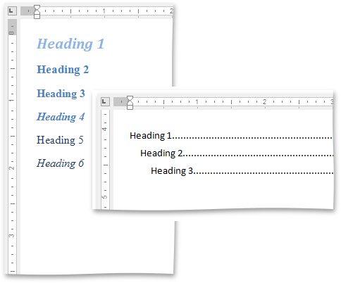
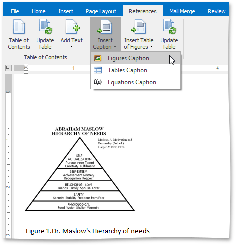
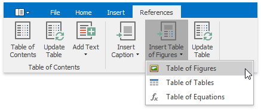
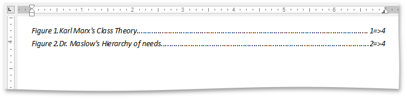

# Create Table of Contents for Special Cases
A table of contents (TOC) in a document is represented by a special TOC field. There is set of TOC field switches that you can combine to create TOCs of different types. This document describes how to create the following TOCs.
* [TOC for the Specified Portion of a Document](#tocspecifiedchapter)
* [TOC Including Paragraphs with Specified Outline Levels](#tocfromspecifiedoutlinelevels)
* [Table of Figures (Tables, Equations)](#tableoffigures)

## <a name="tocspecifiedchapter"/>TOC for the Specified Portion of a Document
To build a TOC consisting of titles (marked with built-in heading styles) from a specified portion of a document only, follow the steps below.
1. Mark entries to be included in the TOC [by using built-in heading styles](create-a-table-of-contents.md) (Heading 1, Heading 2, etc.).
2. Mark a portion of a document whose headings you want to include in the TOC with the _"Chapter1"_ [bookmark](../miscellaneous/insert-a-bookmark.md).
3. Insert an empty field (**CTRL+F9**) and enter a TOC field code with the _\b_ switch and bookmark name: _{TOC \b Chapter1}_.

## <a name="tocfromspecifiedoutlinelevels"/>TOC Including Paragraphs with Specified Outline Levels Only
To [generate a TOC](create-a-table-of-contents.md) from Heading 1, Heading 2 and Heading 3 entries only (or paragraphs with outline levels 1 through 3), use the \o switch in the TOC field code.

| {TOC} | {TOC \o "1-3"} |
|---|---|
|  |  |

## <a name="tableoffigures"/>Table of Figures (Tables, Equations)
The following step-by-step instructions describe how to [create a TOC](create-a-table-of-contents.md) from items numbered by a SEQ field (for example, table of figures), add sequence numbers (figure numbers) before page numbers in the table of contents, and specify the separator between sequence and page numbers.
1. Specify captions for figures that you want to include in the table of figures. To do this, click the **Insert Caption** button on the **References** [tab](../text-editor-ui/ribbon-interface.md) and select **Figures Caption**...
	
	
	
	... or add the _{SEQ Figure}_ field code (via **CTRL+F9**).
2. Click within a document where you wish to insert the table of figures.
3. Click **Insert Table of Figures** on the **References** ribbon tab and select **Table of Figures**.
	
	
	
	If you click the **Show All Field Codes** button on the **Mail Merge** ribbon tab, you will see the TOC field code - _{ TOC \h \c "Figure" }_. The _\c_ switch is used to build a TOC from items that are numbered by a SEQ field.
4. To add figure numbers before page numbers in the table of figures and insert the _=>_ separator between figure and page numbers, use the _\s_ and _\d_ switches of the TOC field - _{ TOC \h \c "Figure" \s Figure \d => }_.
5. Resulting table of figures will look like the following.
	
	

In the same way you can sequentially number tables and equations in a document, and built a table of tables or equations.

> [!NOTE]
> If you add, remove or modify captions, you can quickly update the table of figures by using the **References** button on the **Captions** ribbon tab or by selecting the **Update Field** item from the context menu.