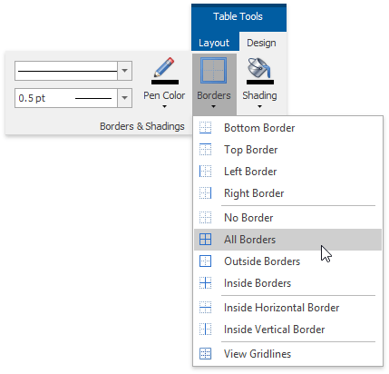
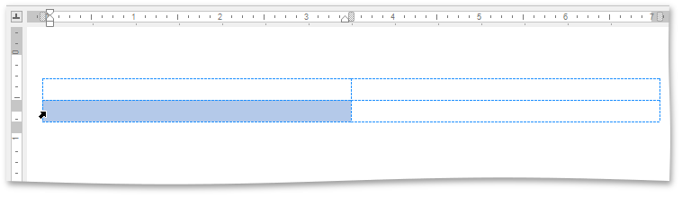
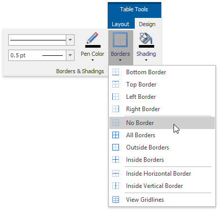
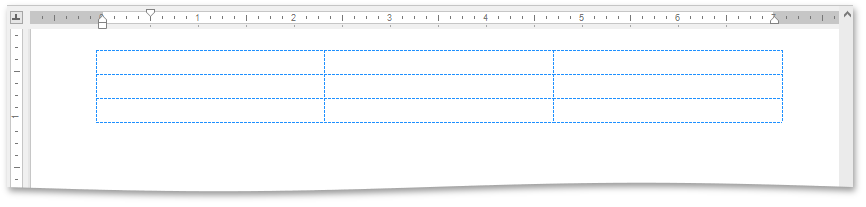
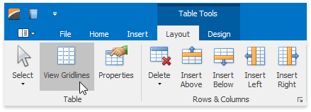

# Add and Remove Table Borders
## Add Borders
* **Add Borders to the Whole Table**
	1. [Select a table](select-a-cell-row-or-column.md).
	2. On the **Table Tools/Layout** tab, in the **Borders&amp;Shadings** group, click the **Borders** button and select one of the available border sets.
		
		
* **Add Borders to Specified Cells Only**
	1. [Display gridlines](#showorhidegridlines) to view boundaries of the table cells and [select cells](select-a-cell-row-or-column.md) to be provided with borders.
		
		
	2. On the **Table Tools/Layout** tab, in the **Borders&amp;Shadings** group, click the **Borders** button and select the border that you want to apply to cells.

## <a name="removeborders"/>Remove Table Borders
* **Remove Borders from the Whole Table**
	1. [Select a table](select-a-cell-row-or-column.md).
	2. On the **Table Tools/Layout** ribbon tab in the **Borders&amp;Shading** group, click the **Borders** button  and select **No Borders** from the invoked list.
		
		
* **Remove Borders from Specified Cells Only**
	1. [Display gridlines](#showorhidegridlines) to view boundaries of the table cells and [select cells](select-a-cell-row-or-column.md) from which you want to remove borders.
		
		
	2. On the **Table Tools/Layout** tab, in the **Borders&amp;Shading** group, click the **Borders** button and select **No Borders** from the invoked list.

## <a name="showorhidegridlines"/>Show or Hide Gridlines
Gridlines show boundaries of a table cells when [no borders are applied](#removeborders). Unlike borders, gridlines are shown on screen only and never printed.

To show or hide table gridlines, on the **Table Tools/Layout** tab, in the **Borders&amp;Shading** group, click the **View Gridlines** button.

