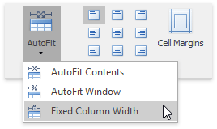

## Automatically Change Column Width to Fit Entered Data
1. Click within a table.
2. On the **Table Tools/Layout** [ tab](../../../../interface-elements-for-desktop/articles/rich-text-editor/text-editor-ui/ribbon-interface.md), in the **Cell Size** group, click the **AutoFit** button and select **AutoFit Contents**.
	
	

## Automatically Change Table Width to Fit Page Margins
1. Click within a table.
2. On the **Table Tools/Layout** [ tab](../../../../interface-elements-for-desktop/articles/rich-text-editor/text-editor-ui/ribbon-interface.md), in the **Cell Size** group, click the **AutoFit** button and select **AutoFit Window**.
	
	

## Fix a Specific Width for Each Column in a Table
1. Specify a width for each column in a table (for example, by using the mouse or via the [Table Properties](../../../../interface-elements-for-desktop/articles/rich-text-editor/tables/set-table-properties.md) dialog).
2. On the **Table Tools/Layout** [ tab](../../../../interface-elements-for-desktop/articles/rich-text-editor/text-editor-ui/ribbon-interface.md), in the **Cell Size** group, click the **AutoFit** button and select **Fixed Column Width**.
	
	