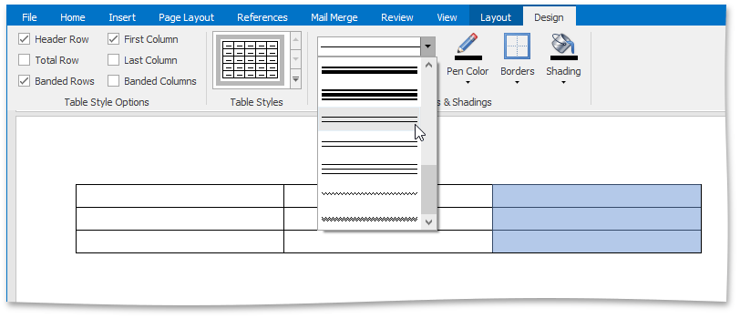

Before you add borders to table cells, you can specify a style to be applied to borders.

To set a style for cell borders, do the following:
1. [Select](../../../../interface-elements-for-desktop/articles/rich-text-editor/tables/select-a-cell-row-or-column.md) a table or specific cells whose borders you want to customize.
2. On the **Table Tools/Layout** [ tab](../../../../interface-elements-for-desktop/articles/rich-text-editor/text-editor-ui/ribbon-interface.md), in the **Borders&amp;Shading** group, change required options (**Line Style**, **Line Weight**, **Pen Color**).
	
	
3. [Add borders](../../../../interface-elements-for-desktop/articles/rich-text-editor/tables/add-and-remove-table-borders.md) using the **Table Styles** group of the **Table Tools / Design** tab.