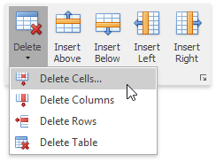
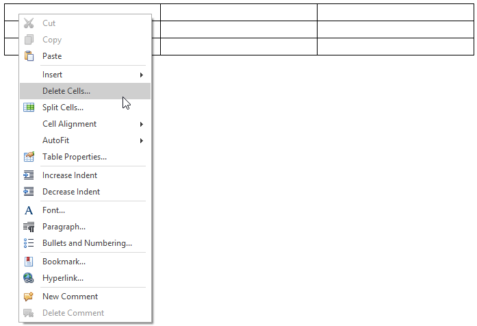
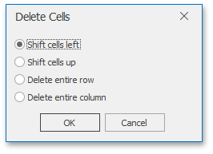
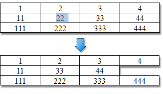
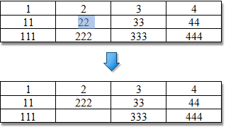
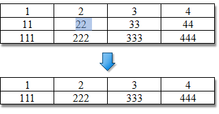
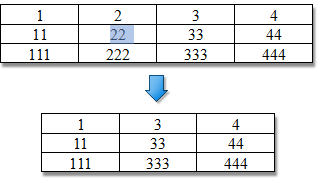
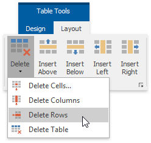
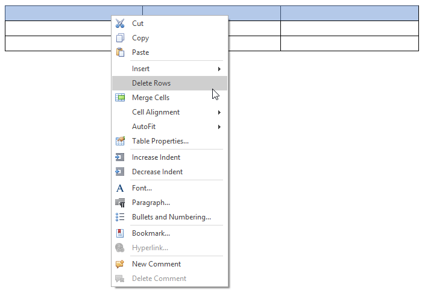
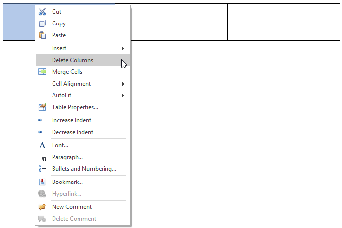

# Delete a Cell, Row or Column
## Delete a Cell
1. Click a cell to be deleted and then on the **Table Tools/Layout** [ tab](../text-editor-ui/ribbon-interface.md), in the **Rows &amp; Columns** group, click the **Delete** button and select **Delete Cells** from the invoked list...
	
	
2. ...or right-click a cell to be deleted and select **Delete Cells...** from the context menu.
	
	
3. In the invoked **Delete Cells** dialog choose one of the available options:
	
	
	
	| Option | Description | Example |
	|---|---|---|
	| **Shift cells left** | Delete the selected cell and move all other cells in the row to the left. |  |
	| **Shift cells up** | Delete the selected cell and move all other cells in the column up. |  |
	| **Delete entire row** | Delete a row containing the selected cell. |  |
	| **Delete entire column** | Delete a column containing the selected cell. |  |

## Delete a Row
1. [Select a row](select-a-cell-row-or-column.md) to be deleted or click on one cell included into that row.
2. On the **Table Tools/Layout** [ tab](../text-editor-ui/ribbon-interface.md), in the **Rows &amp; Columns** group, click the **Delete** button and select **Delete Rows** from the invoked list...
	
	
3. ...or [select a row](select-a-cell-row-or-column.md) to be deleted, right-click it and select **Delete Rows** from the invoked context menu.
	
	

## Delete a Column
1. [Select a column](select-a-cell-row-or-column.md) to be deleted or click on one cell included into that column.
2. On the **Table Tools/Layout** [ tab](../text-editor-ui/ribbon-interface.md), in the **Rows &amp; Columns** group, click the **Delete** button and select **Delete Columns** from the invoked list...
	
	
3. ...or [select a column](select-a-cell-row-or-column.md) to be deleted, right-click it, and select **Delete Columns** from the invoked context menu.
	
	