# Insert a Cell, Row or Column
## Insert a Cell
1. Click a cell located directly to the right or below where you want to insert a cell, and then on the **Table Tools\Layout** [ tab](../text-editor-ui/ribbon-interface.md), in the **Rows &amp; Columns** group, click the **Insert Cells** button...
	
	
2. ...or right-click a cell relative to which you want to add a new cell, select the **Insert** item from the context menu and click **Insert Cells**.
	
	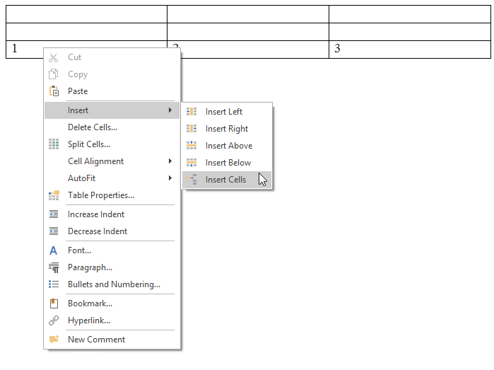
3. In the invoked **Insert Cells** dialog choose one of the available options:
	
	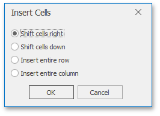
	
	| Option | Description | Example |
	|---|---|---|
	| **Shift cells right** | Insert a new cell just to the left of the selected cell and move the selected cell and all other cells following this cell in that row to the right. | 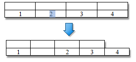 |
	| **Shift cells down** | Insert a new cell in the selected cell's place and move other cells in that column down one row each. A new row will be added at the bottom of the table to include the last existing cell. Remaining cells in this new row will be empty. | 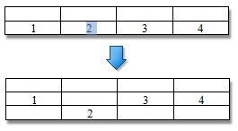 |
	| **Insert entire row** | Insert a new row just above the row containing the selected cell. | 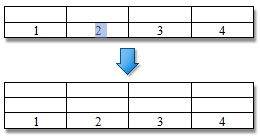 |
	| **Insert entire column** | Insert a new column just to the left of the column containing the selected cell. | 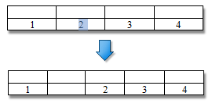 |

## Insert a Row
1. Click a cell located directly below or above where you want to insert a new row.
2. Do one of the following:
	* To add a new row just above the row containing the selected cell, on the **Table Tools\Layout** [ tab](../text-editor-ui/ribbon-interface.md), in the **Rows &amp; Columns** group, click the **Insert Rows Above** button.
		
		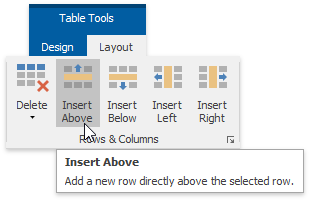
	* To add a new row just below the row containing the selected cell,on the **Table Tools\Layout** [ tab](../text-editor-ui/ribbon-interface.md), in the **Rows &amp; Columns** group, click the **Insert Rows Below** button.
		
		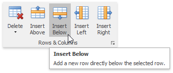
	* ...or right-click a cell relative to which you want to insert a row, click the **Insert** item in the context menu and select **Insert Rows Above** or **Insert Rows Below**.
		
		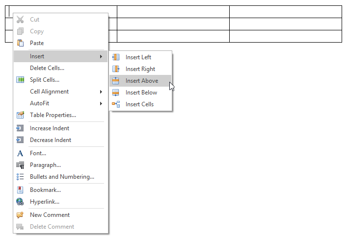

## Insert a Column
1. Click a cell located directly to the right or left of where you want to insert a new column.
2. Do one of the following:
	* To add a new column just to the left of the column containing the selected cell, on the **Table Tools\Layout** [ tab](../text-editor-ui/ribbon-interface.md), in the **Rows &amp; Columns** group, click the **Insert Columns to the Left** button.
		
		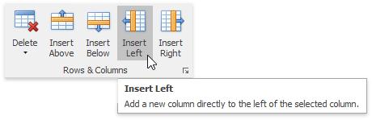
	* To add a new column just to the right of the column containing the selected cell,on the **Table Tools\Layout** [ tab](../text-editor-ui/ribbon-interface.md), in the **Rows &amp;Columns** group, click the **Insert Columns to the Right** button...
		
		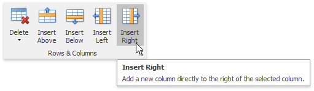
	* ... or right-click a cell relative to which you want to insert a column, click the **Insert** item in the context menu and select **Insert Columns to the Left** or **Insert Columns to the Right**.
		
		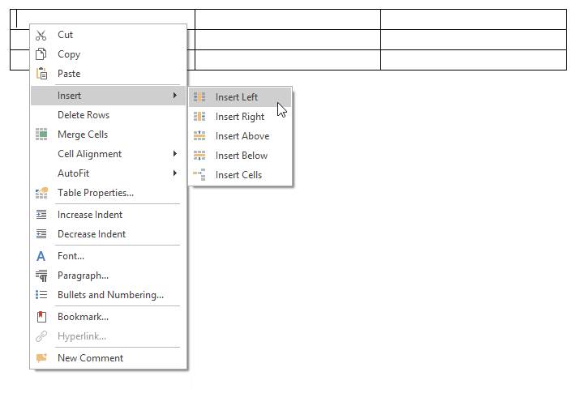