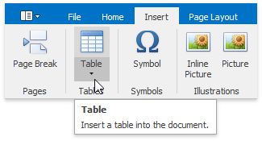
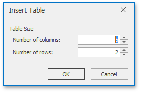
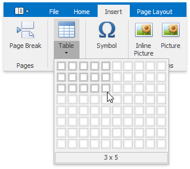

# Insert a Table
## <a name="inserttable"/>Insert a Table
1. Click the position within a document where you want to insert a table.
2. Click the **Table** button on the **Insert** [ tab](../text-editor-ui/ribbon-interface.md).
	
	
3. In the invoked **Insert Table** dialog, select the required number of table rows and columns.
	
	
4. Alternatively, you can select the required table size in the drop-down control box:
	
	

## Insert a Table inside Another Table
Tables that are located inside other tables are called nested tables.

To insert a nested table:
1. Point to the position within a table cell where you want to insert a table.
2. [Insert a table.](#inserttable)