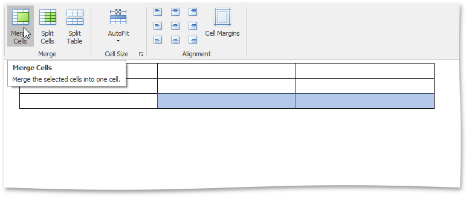
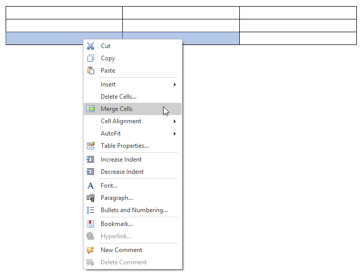
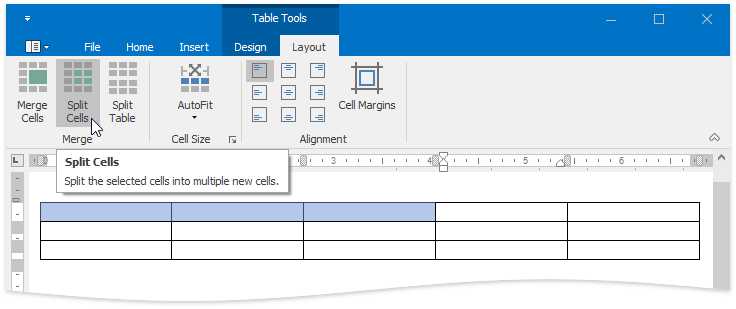
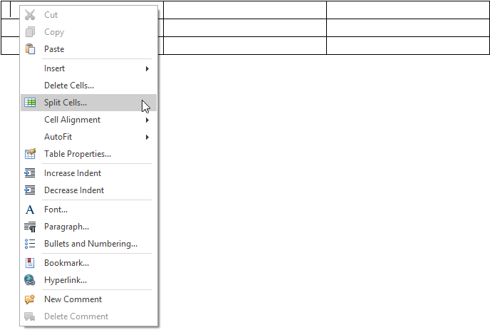
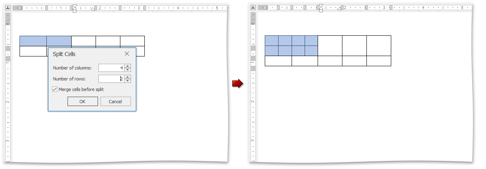
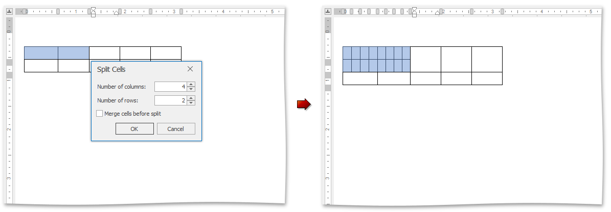
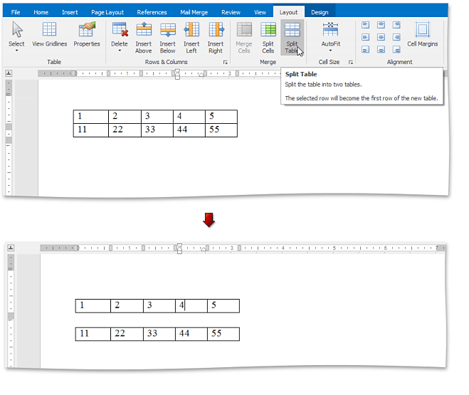

# Merge or Split Cells
## Merge Cells
1. Select cells that you wish to merge. For example, you can [select multiple cells, a whole row or column](select-a-cell-row-or-column.md).
2. On the **Table Tools/Layout** [ tab](../text-editor-ui/ribbon-interface.md), in the **Merge** group, click the **Merge Cells** button.
	
	
	
	–You can also:
	
	Right-click cells to be merged and select **Merge Cells** from the context menu.
	
	
	
	> [!NOTE]
	> The **Merge Cells** button becomes available, after you have selected the table cells to be merged.

## Split Cells
1. Click a cell or select multiple cells that you wish to split.
2. On the **Table Tools/Layout** [ tab](../text-editor-ui/ribbon-interface.md), in the **Merge** group, click the **Split Cells** button.
	
	
	
	–You can also:
	
	If you wish to split a single cell, right-click this cell and select **Split Cells** from the context menu.
	
	
	
	> [!NOTE]
	> The **Split Cells...** item of the context menu is available, if you right-click one cell of a table only.
3. In the invoked **Split Cells** dialog, set the number of columns and rows into which the selected cells should be split.
	
	If multiple cells are selected, you can first merge these cells and then spit the newly created cell into the specified number of columns and rows (select the **Merge cells before split** check box in the dialog) ...
	
	
	
	... or each of the selected cells can be split (clear the **Merge cells before split** check box).
	
	

## Split Table
1. Click any cell included into a row relative to which you wish to split a table. This row will be the first row of the second table.
2. On the **Table Tools/Layout** [ tab](../text-editor-ui/ribbon-interface.md), in the **Merge** group, click the **Split Table** button.
	
	