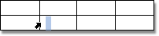
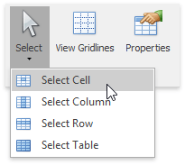
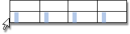
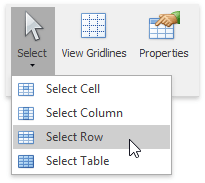
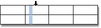
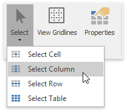
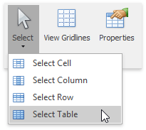

# Select a Cell, Row or Column
## Select a Cell
You can select a table cell in one of the following ways.
* Double-click a cell.
* Click the left edge of a cell.
	
	
* Click a cell to be selected. Then on the **Table Tools/Layout** [ tab](../text-editor-ui/ribbon-interface.md), in the **Table** group, click the **Select** button and choose **Select Cell** from the invoked list.
	
	

> [!NOTE]
> To select multiple cells, click the left edge of a cell and then drag it across other cells.

## Select a Row
To select a table row you can do one of the following.
* Click to the left of a row.
	
	
* Click a cell included into a row to be selected. Then on the **Table Tools/Layout** [ tab](../text-editor-ui/ribbon-interface.md), in the **Table** group, click the **Select** button and choose **Select Row** from the invoked list.
	
	

## Select a Column
To select a table column you can do one of the following.
* Click the top edge of a column.
	
	
* Click a cell included into a column to be selected. Then on the **Table Tools/Layout** [ tab](../text-editor-ui/ribbon-interface.md), in the **Table** group, click the **Select** button and choose **Select Column** from the invoked list.
	
	

## Select a Table
Click any cell of a table. Then on the **Table Tools/Layout** [ tab](../text-editor-ui/ribbon-interface.md), in the **Table** group, click the **Select** button and choose the **Select Table** item from the invoked list.

