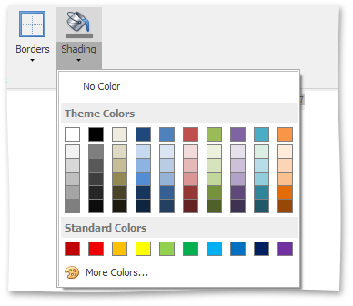

# Set Background Color of Cells
1. [Select](select-a-cell-row-or-column.md) a table or specific cells whose background color you want to set.
2. Click the **Shading** arrow and select a color to fill-in the background of the selected cells.
	
	