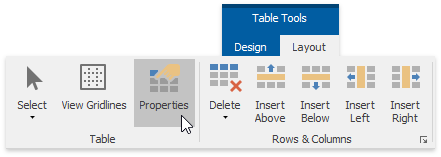
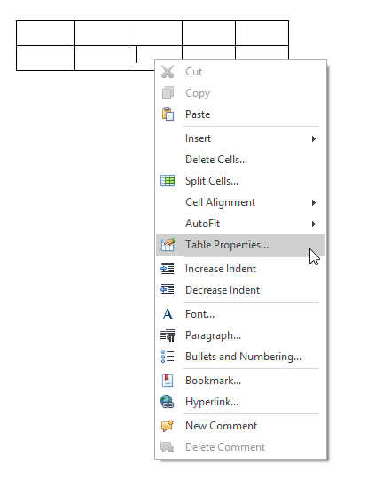
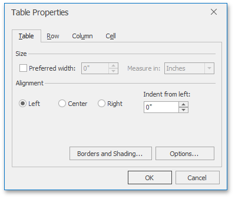
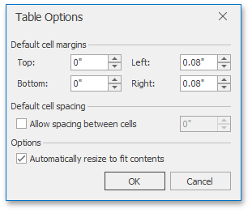
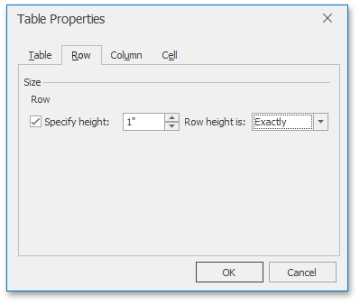
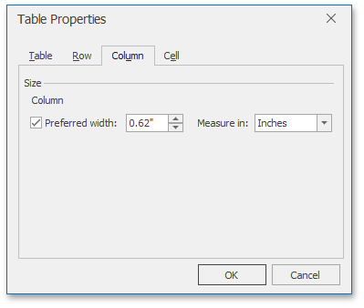
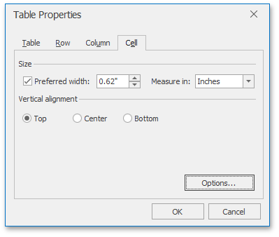
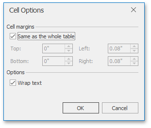

# Set Table Properties
To change settings of table [rows](#row), [columns](#column), particular [cells](#cell) or whole [tables](#table), use the **Table Properties** dialog. To invoke this dialog, click within a table whose properties you wish to specify, and on the **Table Tools/Layout** [tab](../text-editor-ui/ribbon-interface.md), in the **Table** group, click the **Properties** button.

–You can also:

Right-click within a table to be modified and select **Table Properties...** form the context menu.

The **Table Properties** dialog includes several tabs.
* <a name="table"/>On the **Table** tab you can set table properties, such as the preferred width for an entire table and table alignment (position of the table relative to the margins of the page).
	
	
	
	The **Options...** button invokes the **Table Options** dialog that allows you to set default cell margins (spacing between cell borders and text within each cell), specify whether the additional space should be between cells, set the amount of this space, and set whether or not table columns should be automatically expanded to accommodate cell content.
	
	
* <a name="row"/>The **Row** tab allows you to set the height of the table row, enable or disable the row to break across pages, and specify whether or not the row should be the first row on each page in case the table is more than one page.
	
	
* <a name="column"/>On the **Column** tab, you can set the preferred width for the table column.
	
	
* <a name="cell"/>Options on the **Cell** tab allow you to set the preferred width of the table cell and select a vertical alignment of the text within the cell.
	
	
	
	The **Options...** button invokes the **Cell Options** dialog allowing you to customize cell margins (space between cell borders and cell content) and specify whether or not the text within the cell should be wrapped and fitted.
	
	