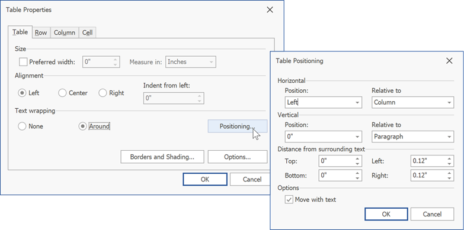

# Wrap Text Around a Table

* Place the cursor within the target table.
* Click the **Properties** button in the **Table** group on the **Table Tools/Layout** [tab](../text-editor-ui/ribbon-interface.md) or invoke the context menu and select **Table Properties**.

    

    
* In the invoked **Table Properties** dialog, click **Around** in the **Text Wrapping** section. Click the enabled **Positioning** button to open the **Table Positioning** dialog.

    
* In this dialog, you can specify the table's horizontal and vertical positions. Enter a numeric value in the **Position** combo box to specify an absolute position. To set a relative position, select the required alignment from the **Position** list and the relative element from the **Relative to:** list.

* Specify the distance between the table and surrounding text in the **Distance from surrounding text** section.

* Check **Move with Text** to make the table move with surrounding text.
