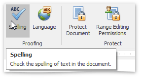
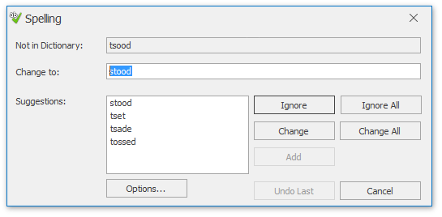

# Check Text Spelling
The **Rich Text Editor** supports spell-check. All misspelled words in your document (words that are not found within the available dictionaries in the **Spell Checker**) are underlined. You can work with misspelled words via the context menu, invoked when right-clicking the underlined word.

In the context menu, you can do one of the following:
* Select one of the suggested corrections for the misspelled word to correct it;
* Ignore the current occurrence of the word;
* Ignore all occurrences of the word;
* Add the word to the dictionary in the **Spell Checker**.

To perform spell check word-by-word, select the **Check Spelling** item from the context menu, or on the **Review** [ tab](../text-editor-ui/ribbon-interface.md), in the **Proofing** group, click the **Spelling** button ...

... or press **F7**.

The **Spelling** dialog will be invoked.

In this dialog, select what to do with the misspelled word, click corresponding button, and you will jump to the next misspelled word.