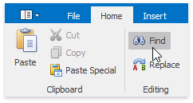
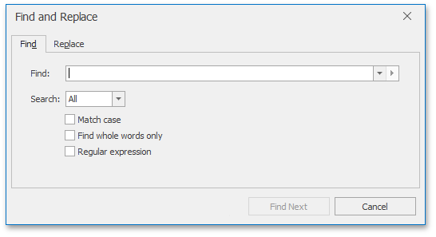
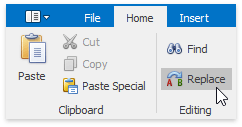
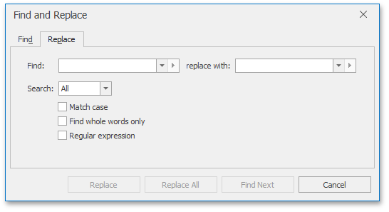
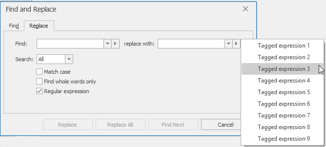

# Find and Replace Text
## Find Text
To search for every occurrence of a specific word or phrase:
1. On the **Home** [ tab](../text-editor-ui/ribbon-interface.md), in the **Editing** group, click the **Find** button...
	
	
	
	... or press **CTRL+F**.
	
	The **Find and Replace** dialog will be invoked.
	
	
2. In the **Find what** box, type the text to search for.
3. Select other search options that you want and click **Find Next**.
4. To cancel a search, click **Cancel** or press **ESC**.

## Find and Replace Text
To automatically replace text:
1. On the **Home** [tab](../text-editor-ui/ribbon-interface.md), in the **Editing** group, click the **Replace** button...
	
	
	
	... or press **CTRL+H**.
	
	The **Find and Replace** dialog will be invoked.
	
	
2. In the **Find what** box, type the text to replace.
3. In the **Replace with** box, type the replacement text.
4. Select other search options that you want and click **Find Next**, **Replace** or **Replace All**.

## Use Regular Expressions to Find and Replace Text
You can use regular expressions to search for specific text containing a particular pattern:
1. On the **Home** [ tab](../text-editor-ui/ribbon-interface.md), in the **Editing** group, click **Find** or **Replace**...
	
	 
	
	... or press **CTRL+F** or **CTRL+H**.
	
	The **Find and Replace** dialog will be invoked.
	
	
2. Select the **Regular expression** check box.
3. In the **Find what** box, enter the regular expression pattern using a list of specific characters:
	
	
4. If you want to replace the found text, click the **Replace** tab and enter the replacement text in the **Replace with** box.
	
	> [!NOTE]
	> You can tag various parts of a regular expression to use them in replacement expression (for example, to rearrange the parts of the expression). A regular expression may have up to **9** tagged expressions, numbered according to their order in the regular expression. To enter a tagged expression in the **Replace with** box, enter its index after the symbol $ or select it from the list of tagged expressions:
	> 
	> 
5. Click **Find Next**, **Replace** or **Replace All**.