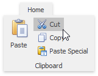
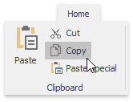
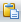
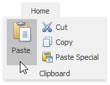
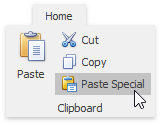
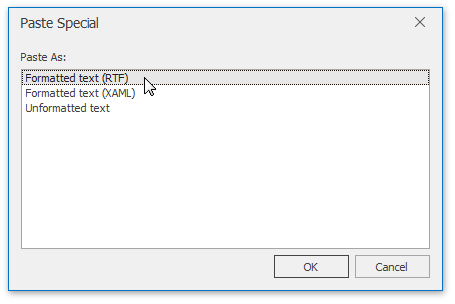

# Use a Clipboard
The **Rich Text Editor** allows you to move and copy text and images using the Clipboard.

To move or copy a text or image, follow the steps below.
1. [Select the text or image](select-text.md) you wish to move or copy.
2. Depending on what you want, do one of the following.
	* To move the selection, on the **Home** [ tab](../text-editor-ui/ribbon-interface.md), in the **Clipboard** group, click the **Cut** button , or press **CTRL+X**, or press **SHIFT+DELETE**. This cuts the selection from the document and places it on the Clipboard.
		
		
	* To copy the selection, on the **Home** [ tab](../text-editor-ui/ribbon-interface.md), in the **Clipboard** group, click the **Copy**, or press **CTRL+C**, or press **CTRL+INSERT**. This copies the selection and places it on the Clipboard.
		
		
3. Point to the position where you want to insert the contents from the Clipboard.
4. On the **Home** [ tab](../text-editor-ui/ribbon-interface.md), in the **Clipboard** group, click the **Paste**  button, or press **CTRL+V**, or press **SHIFT+INSERT**. This pastes the contents of the Clipboard into the document.
	
	
	
	You can also choose the format for data contained in the Clipboard and paste it into the document as if that data is imported from the specified format. To do this, on the **Home** [ tab](../text-editor-ui/ribbon-interface.md), in the **Clipboard** group, click the **Paste Special**, or press **CTRL+ALT+V**, ...
	
	
	
	... and select the required data format from the invoked **Paste Special** dialog.
	
	