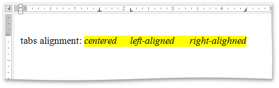
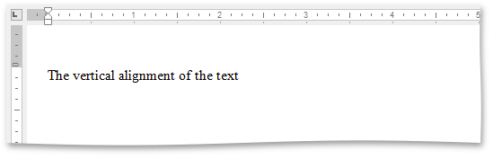

# Editor Elements
The **Rich Text Editor** consists of visual elements that provide you with the capability to edit and view documents.

## Main Elements
The main area of the **Rich Text Editor** control is the **Text Editing Surface** that displays a document to be edited. Here, a document can look as it will appear when you print it (**Print Layout View**) or with reduced formatting and pagination (**Simple View** or **Draft View**). For more information, see [Switch Document Views](../viewing-and-navigating/switch-document-views.md).

To the top and to the left of the **Text Editing Surface**, the **Rich Text Editor** displays horizontal and vertical **rulers**, which you can use to align text, graphics, and other elements in a document.

The **horizontal ruler** controls the width of table columns and the horizontal spacing of paragraph margins, columns and tabs.

The **vertical ruler** allows you to set the top and bottom margins of a document, and change the height of table rows.

> [!NOTE]
> If the ruler is hidden, [switch the current view](../viewing-and-navigating/switch-document-views.md) to either the **Draft View** or **Print Layout View**.

At the bottom and at the right of the **Text Editing Surface** there are horizontal and vertical **scrollbars**, which allow you to navigate through a document.

## Context Menu
The **Rich Text Editor** supports the **Context Menu** that appears when you right-click within the **Text Editing Surface**. The context menu provides common commands and displays suggested corrections if you right-click a misspelled word.

