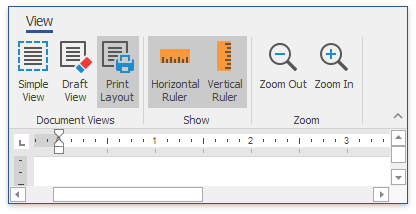
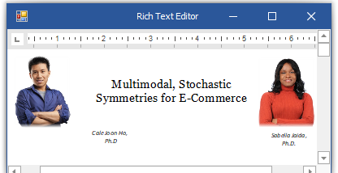
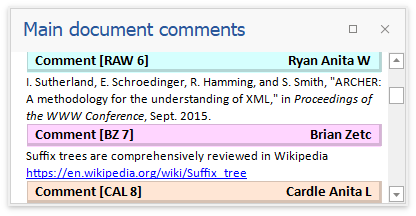
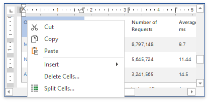

# Editor Elements

The Rich Text Editor can contain the following visual elements:

## Command UI

The Rich Text Editor can be provided with a Ribbon or with a set of toolbars. Each command bar type enables end users to perform basic operations (format and edit text, create lists, add headers and footers, work with tables, etc.).

## Views

The Rich Text Editor is able to display documents in three different ways depending on the applied **View**. You can change the active view and control the visibility of the editing surface elements.

## Rulers

The Rich Text Editor's editing surface is provided with horizontal and vertical rulers. The rulers help end you align text, shapes, tables and other elements.

## Scrollbars

The document view can display horizontal and vertical scrollbars if a page does not fit into the control's display area.

## Reviewing Pane

The Reviewing Pane displays all comments contained in the document and allows you to navigate throughout the comments and modify them.

## Pop-up Menus

When you clicks different visual objects, a specific pop-up menu appears. The Rich Text Editor provides several pop-up menu types.
