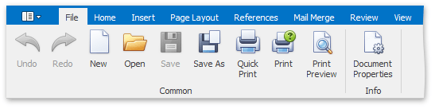
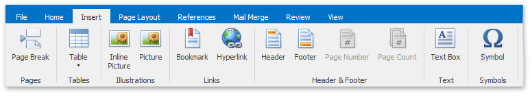
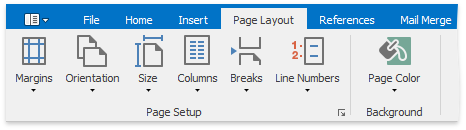
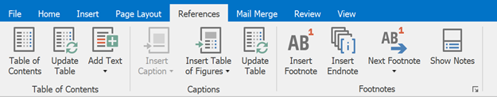
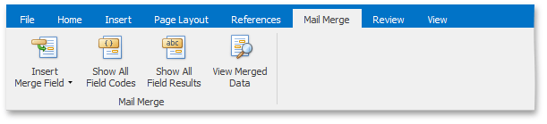
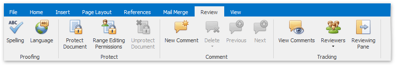
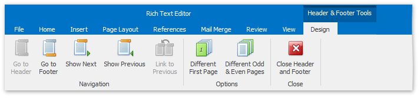
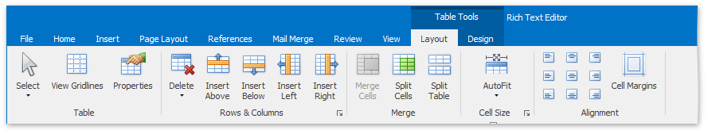
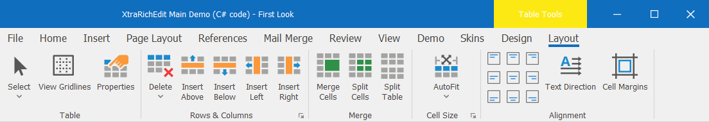
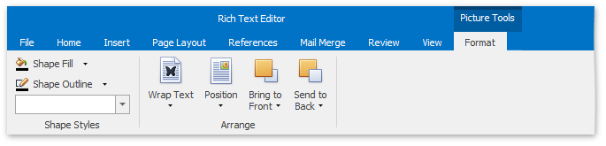

# Ribbon Interface
The comprehensive functionality for the **Rich Text** control can be provided via set of Ribbon tabbed pages. Ribbon pages are structurally and visually split into logical groups. Each of these groups includes commands that have some common features.

## File

* [Create a New Document](../file-operations/create-a-new-document.md)
* [Load a Document](../file-operations/load-a-document.md)
* [Save a Document](../file-operations/save-a-document.md)
* [Print a Document](../file-operations/print-a-document.md)
* [Undo and Redo Last Operations](../text-editing/undo-and-redo-last-operations.md)
* [Set Document Properties](../miscellaneous/set-document-properties.md)

## Home

* [Use a Clipboard](../text-editing/use-a-clipboard.md)
* [Format Text](../formatting/format-text.md)
* [Format Paragraphs](../formatting/format-paragraphs.md)
* [Apply and Modify Styles](../formatting/apply-and-modify-styles.md)
* [Find and Replace Text](../text-editing/find-and-replace-text.md)

## Insert

* [Insert a Page Break](../miscellaneous/insert-a-page-break.md)
* [Insert a Table](../tables/insert-a-table.md)
* [Insert a Picture](../pictures-and-text-boxes/insert-a-picture.md)
* [Insert a Bookmark](../miscellaneous/insert-a-bookmark.md)
* [Insert a Hyperlink](../miscellaneous/insert-a-hyperlink.md)
* [Header and Footer](../header-and-footer.md)
* [Insert Page Numbers](../miscellaneous/insert-page-numbers.md)
* [Insert, Select, Copy or Delete a Text Box](../pictures-and-text-boxes/insert-select-copy-or-delete-a-text-box.md)
* [Insert a Symbol](../miscellaneous/insert-a-symbol.md)

## Page Layout

* [Adjust Page Settings](../document-layout-and-page-setup/adjust-page-settings.md)
* [Lay Out Text in Columns](../document-layout-and-page-setup/lay-out-text-in-columns.md)
* [Insert a Page Break](../miscellaneous/insert-a-page-break.md)
* [Divide a Documents into Sections](../document-layout-and-page-setup/divide-a-documents-into-sections.md)
* [Add Line Numbers](../document-layout-and-page-setup/add-line-numbers.md)
* [Change Page Background Color](../document-layout-and-page-setup/change-page-background-color.md)

## References

* [Create a Table of Contents](../table-of-contents/create-a-table-of-contents.md)
* [Create Table of Contents for Special Cases](../table-of-contents/create-table-of-contents-for-special-cases.md)
* [Update Table of Contents](../table-of-contents/update-table-of-contents.md)

## Mail Merge

[Mail Merge](../mail-merge.md)

## Review

* [Check Text Spelling](../text-editing/check-text-spelling.md)
* [Protect and Unprotect a Document](../document-protection/protect-and-unprotect-a-document.md)
* [Insert a Comment](../miscellaneous/insert-a-comment.md)

## View

* [Switch Document Views](../viewing-and-navigating/switch-document-views.md)
* [Show Rulers](../viewing-and-navigating/switch-document-views.md)
* [Zoom a Document](../viewing-and-navigating/zoom-a-document.md)

## Header &amp; Footer Tools / Design

[Header and Footer](../header-and-footer.md)

## Table Tools / Design

* [Select a Cell, Row or Column](../tables/select-a-cell-row-or-column.md)
* [Set Table Properties](../tables/set-table-properties.md)
* [Insert a Cell, Row or Column](../tables/insert-a-cell-row-or-column.md)
* [Delete a Cell, Row or Column](../tables/delete-a-cell-row-or-column.md)
* [Merge or Split Cells](../tables/merge-or-split-cells.md)
* [Adjust Column Width](../tables/adjust-column-width.md)
* [Align Text in Table Cells](../tables/align-text-in-table-cells.md)

## Table Tools / Layout

* [Add and Remove Table Borders](../tables/add-and-remove-table-borders.md)
* [Customize a Style of Cell Borders](../tables/customize-a-style-of-cell-borders.md)
* [Set Background Color of Cells](../tables/set-background-color-of-cells.md)

## Picture Tools / Format

* [Add, Change or Delete a Border for a Picture or Text Box](../pictures-and-text-boxes/add-change-or-delete-a-border-for-a-picture-or-text-box.md)
* [Add, Change or Delete a Text Box Fill](../pictures-and-text-boxes/add-change-or-delete-a-text-box-fill.md)
* [Wrap Text around a Picture or Text Box](../pictures-and-text-boxes/wrap-text-around-a-picture-or-text-box.md)
* [Move a Picture or Text Box](../pictures-and-text-boxes/move-a-picture-or-text-box.md)