# Toolbars
The **Rich Text** control can be accompanied by a set of toolbars that provide a comprehensive functionality for the **Rich Editor**.

## Common

* [Create a New Document](../file-operations/create-a-new-document.md)
* [Load a Document](../file-operations/load-a-document.md)
* [Save a Document](../file-operations/save-a-document.md)
* [Print a Document](../file-operations/print-a-document.md)
* [Undo and Redo Last Operations](../text-editing/undo-and-redo-last-operations.md)

## Info

[Set Document Properties](../miscellaneous/set-document-properties.md)

## Clipboard
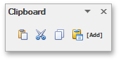

[Use a Clipboard](../text-editing/use-a-clipboard.md)

## Font
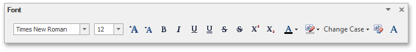

[Format Text](../formatting/format-text.md)

## Paragraph
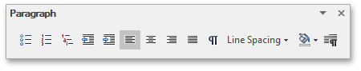

[Format Paragraphs](../formatting/format-paragraphs.md)

## Editing
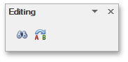

[Find and Replace Text](../text-editing/find-and-replace-text.md)

## Styles
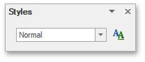

[Apply and Modify Styles](../formatting/apply-and-modify-styles.md)

## Pages

[Insert a Page Break](../miscellaneous/insert-a-page-break.md)

## Tables

[Insert a Table](../tables/insert-a-table.md)

## Illustrations
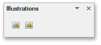

[Insert a Picture](../pictures-and-text-boxes/insert-a-picture.md)

## Text
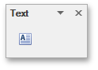

[Insert, Select, Copy or Delete a Text Box](../pictures-and-text-boxes/insert-select-copy-or-delete-a-text-box.md)

## Links

* [Insert a Bookmark](../miscellaneous/insert-a-bookmark.md)
* [Insert a Hyperlink](../miscellaneous/insert-a-hyperlink.md)

## Header &amp; Footer

* [Header and Footer](../header-and-footer.md)
* [Insert Page Numbers](../miscellaneous/insert-page-numbers.md)

## Symbols

[Insert a Symbol](../miscellaneous/insert-a-symbol.md)

## Page Setup
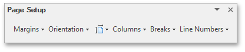
* [Adjust Page Settings](../document-layout-and-page-setup/adjust-page-settings.md)
* [Lay Out Text in Columns](../document-layout-and-page-setup/lay-out-text-in-columns.md)
* [Insert a Page Break](../miscellaneous/insert-a-page-break.md)
* [Divide a Documents into Sections](../document-layout-and-page-setup/divide-a-documents-into-sections.md)
* [Add Line Numbers](../document-layout-and-page-setup/add-line-numbers.md)

## Background
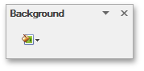

[Change Page Background Color](../document-layout-and-page-setup/change-page-background-color.md)

## Mail Merge

[Mail Merge](../mail-merge.md)

## Document Views
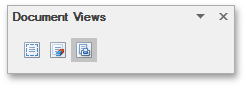

[Switch Document Views](../viewing-and-navigating/switch-document-views.md)

## Show
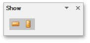

[Show Rulers](../viewing-and-navigating/switch-document-views.md)

## Zoom
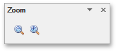

[Zoom a Document](../viewing-and-navigating/zoom-a-document.md)

## Navigation
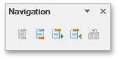

[Header and Footer](../header-and-footer.md)

## Options
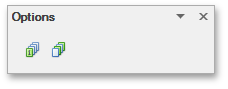

[Header and Footer](../header-and-footer.md)

## Close

[Header and Footer](../header-and-footer.md)

## Table Styles
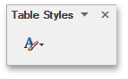

[Add and Remove Table Borders](../tables/add-and-remove-table-borders.md)

## Table Style Options

[Add and Remove Table Borders](../tables/add-and-remove-table-borders.md)

## Borders&amp;Shadings
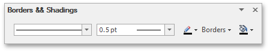
* [Customize a Style of Cell Borders](../tables/customize-a-style-of-cell-borders.md)
* [Set Background Color of Cells](../tables/set-background-color-of-cells.md)

## Table

* [Select a Cell, Row or Column](../tables/select-a-cell-row-or-column.md)
* [Set Table Properties](../tables/set-table-properties.md)

## Rows &#38; Columns

* [Insert a Cell, Row or Column](../tables/insert-a-cell-row-or-column.md)
* [Delete a Cell, Row or Column](../tables/delete-a-cell-row-or-column.md)

## Merge

[Merge or Split Cells](../tables/merge-or-split-cells.md)

## Cell Size
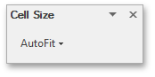

[Adjust Column Width](../tables/adjust-column-width.md)

## Alignment
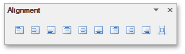

[Align Text in Table Cells](../tables/align-text-in-table-cells.md)

## Protect

[Protect and Unprotect a Document](../document-protection/protect-and-unprotect-a-document.md)

## Proofing

[Check Text Spelling](../text-editing/check-text-spelling.md)

## Table of Contents
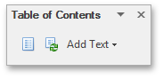
* [Create a Table of Contents](../table-of-contents/create-a-table-of-contents.md)
* [Create Table of Contents for Special Cases](../table-of-contents/create-table-of-contents-for-special-cases.md)
* [Update Table of Contents](../table-of-contents/update-table-of-contents.md)

## Captions
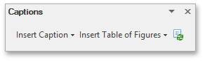

[Create Table of Contents for Special Cases](../table-of-contents/create-table-of-contents-for-special-cases.md)

## Shape Styles
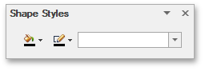
* [Add, Change or Delete a Border for a Picture or Text Box](../pictures-and-text-boxes/add-change-or-delete-a-border-for-a-picture-or-text-box.md)
* [Add, Change or Delete a Text Box Fill](../pictures-and-text-boxes/add-change-or-delete-a-text-box-fill.md)

## Arrange

* [Wrap Text around a Picture or Text Box](../pictures-and-text-boxes/wrap-text-around-a-picture-or-text-box.md)
* [Move a Picture or Text Box](../pictures-and-text-boxes/move-a-picture-or-text-box.md)

## Comment

[Insert a Comment](../miscellaneous/insert-a-comment.md)

## Tracking
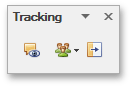

[Insert a Comment](../miscellaneous/insert-a-comment.md)