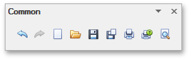
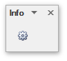
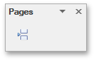
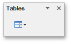
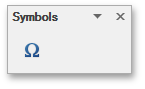
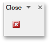
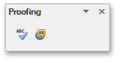

# Toolbars
The **Rich Text** control can be accompanied by a set of toolbars that provide a comprehensive functionality for the **Rich Editor**.

## Common

* [Create a New Document](../../../../interface-elements-for-desktop/articles/rich-text-editor/file-operations/create-a-new-document.md)
* [Load a Document](../../../../interface-elements-for-desktop/articles/rich-text-editor/file-operations/load-a-document.md)
* [Save a Document](../../../../interface-elements-for-desktop/articles/rich-text-editor/file-operations/save-a-document.md)
* [Print a Document](../../../../interface-elements-for-desktop/articles/rich-text-editor/file-operations/print-a-document.md)
* [Undo and Redo Last Operations](../../../../interface-elements-for-desktop/articles/rich-text-editor/text-editing/undo-and-redo-last-operations.md)

## Info

[Set Document Properties](../../../../interface-elements-for-desktop/articles/rich-text-editor/miscellaneous/set-document-properties.md)

## Clipboard

[Use a Clipboard](../../../../interface-elements-for-desktop/articles/rich-text-editor/text-editing/use-a-clipboard.md)

## Font

[Format Text](../../../../interface-elements-for-desktop/articles/rich-text-editor/formatting/format-text.md)

## Paragraph

[Format Paragraphs](../../../../interface-elements-for-desktop/articles/rich-text-editor/formatting/format-paragraphs.md)

## Editing

[Find and Replace Text](../../../../interface-elements-for-desktop/articles/rich-text-editor/text-editing/find-and-replace-text.md)

## Styles

[Apply and Modify Styles](../../../../interface-elements-for-desktop/articles/rich-text-editor/formatting/apply-and-modify-styles.md)

## Pages

[Insert a Page Break](../../../../interface-elements-for-desktop/articles/rich-text-editor/miscellaneous/insert-a-page-break.md)

## Tables

[Insert a Table](../../../../interface-elements-for-desktop/articles/rich-text-editor/tables/insert-a-table.md)

## Illustrations

[Insert a Picture](../../../../interface-elements-for-desktop/articles/rich-text-editor/pictures-and-text-boxes/insert-a-picture.md)

## Text

[Insert, Select, Copy or Delete a Text Box](../../../../interface-elements-for-desktop/articles/rich-text-editor/pictures-and-text-boxes/insert-select-copy-or-delete-a-text-box.md)

## Links

* [Insert a Bookmark](../../../../interface-elements-for-desktop/articles/rich-text-editor/miscellaneous/insert-a-bookmark.md)
* [Insert a Hyperlink](../../../../interface-elements-for-desktop/articles/rich-text-editor/miscellaneous/insert-a-hyperlink.md)

## Header &amp; Footer

* [Header and Footer](../../../../interface-elements-for-desktop/articles/rich-text-editor/header-and-footer.md)
* [Insert Page Numbers](../../../../interface-elements-for-desktop/articles/rich-text-editor/miscellaneous/insert-page-numbers.md)

## Symbols

[Insert a Symbol](../../../../interface-elements-for-desktop/articles/rich-text-editor/miscellaneous/insert-a-symbol.md)

## Page Setup

* [Adjust Page Settings](../../../../interface-elements-for-desktop/articles/rich-text-editor/document-layout-and-page-setup/adjust-page-settings.md)
* [Lay Out Text in Columns](../../../../interface-elements-for-desktop/articles/rich-text-editor/document-layout-and-page-setup/lay-out-text-in-columns.md)
* [Insert a Page Break](../../../../interface-elements-for-desktop/articles/rich-text-editor/miscellaneous/insert-a-page-break.md)
* [Divide a Documents into Sections](../../../../interface-elements-for-desktop/articles/rich-text-editor/document-layout-and-page-setup/divide-a-documents-into-sections.md)
* [Add Line Numbers](../../../../interface-elements-for-desktop/articles/rich-text-editor/document-layout-and-page-setup/add-line-numbers.md)

## Background

[Change Page Background Color](../../../../interface-elements-for-desktop/articles/rich-text-editor/document-layout-and-page-setup/change-page-background-color.md)

## Mail Merge

[Mail Merge](../../../../interface-elements-for-desktop/articles/rich-text-editor/mail-merge.md)

## Document Views

[Switch Document Views](../../../../interface-elements-for-desktop/articles/rich-text-editor/viewing-and-navigating/switch-document-views.md)

## Show

[Show Rulers](../../../../interface-elements-for-desktop/articles/rich-text-editor/viewing-and-navigating/switch-document-views.md)

## Zoom

[Zoom a Document](../../../../interface-elements-for-desktop/articles/rich-text-editor/viewing-and-navigating/zoom-a-document.md)

## Navigation

[Header and Footer](../../../../interface-elements-for-desktop/articles/rich-text-editor/header-and-footer.md)

## Options

[Header and Footer](../../../../interface-elements-for-desktop/articles/rich-text-editor/header-and-footer.md)

## Close

[Header and Footer](../../../../interface-elements-for-desktop/articles/rich-text-editor/header-and-footer.md)

## Table Styles

[Add and Remove Table Borders](../../../../interface-elements-for-desktop/articles/rich-text-editor/tables/add-and-remove-table-borders.md)

## Table Style Options

[Add and Remove Table Borders](../../../../interface-elements-for-desktop/articles/rich-text-editor/tables/add-and-remove-table-borders.md)

## Borders&amp;Shadings

* [Customize a Style of Cell Borders](../../../../interface-elements-for-desktop/articles/rich-text-editor/tables/customize-a-style-of-cell-borders.md)
* [Set Background Color of Cells](../../../../interface-elements-for-desktop/articles/rich-text-editor/tables/set-background-color-of-cells.md)

## Table

* [Select a Cell, Row or Column](../../../../interface-elements-for-desktop/articles/rich-text-editor/tables/select-a-cell-row-or-column.md)
* [Set Table Properties](../../../../interface-elements-for-desktop/articles/rich-text-editor/tables/set-table-properties.md)

## Rows &#38; Columns

* [Insert a Cell, Row or Column](../../../../interface-elements-for-desktop/articles/rich-text-editor/tables/insert-a-cell-row-or-column.md)
* [Delete a Cell, Row or Column](../../../../interface-elements-for-desktop/articles/rich-text-editor/tables/delete-a-cell-row-or-column.md)

## Merge

[Merge or Split Cells](../../../../interface-elements-for-desktop/articles/rich-text-editor/tables/merge-or-split-cells.md)

## Cell Size

[Adjust Column Width](../../../../interface-elements-for-desktop/articles/rich-text-editor/tables/adjust-column-width.md)

## Alignment

[Align Text in Table Cells](../../../../interface-elements-for-desktop/articles/rich-text-editor/tables/align-text-in-table-cells.md)

## Protect

[Protect and Unprotect a Document](../../../../interface-elements-for-desktop/articles/rich-text-editor/document-protection/protect-and-unprotect-a-document.md)

## Proofing

[Check Text Spelling](../../../../interface-elements-for-desktop/articles/rich-text-editor/text-editing/check-text-spelling.md)

## Table of Contents

* [Create a Table of Contents](../../../../interface-elements-for-desktop/articles/rich-text-editor/table-of-contents/create-a-table-of-contents.md)
* [Create Table of Contents for Special Cases](../../../../interface-elements-for-desktop/articles/rich-text-editor/table-of-contents/create-table-of-contents-for-special-cases.md)
* [Update Table of Contents](../../../../interface-elements-for-desktop/articles/rich-text-editor/table-of-contents/update-table-of-contents.md)

## Captions

[Create Table of Contents for Special Cases](../../../../interface-elements-for-desktop/articles/rich-text-editor/table-of-contents/create-table-of-contents-for-special-cases.md)

## Shape Styles

* [Add, Change or Delete a Border for a Picture or Text Box](../../../../interface-elements-for-desktop/articles/rich-text-editor/pictures-and-text-boxes/add-change-or-delete-a-border-for-a-picture-or-text-box.md)
* [Add, Change or Delete a Text Box Fill](../../../../interface-elements-for-desktop/articles/rich-text-editor/pictures-and-text-boxes/add-change-or-delete-a-text-box-fill.md)

## Arrange

* [Wrap Text around a Picture or Text Box](../../../../interface-elements-for-desktop/articles/rich-text-editor/pictures-and-text-boxes/wrap-text-around-a-picture-or-text-box.md)
* [Move a Picture or Text Box](../../../../interface-elements-for-desktop/articles/rich-text-editor/pictures-and-text-boxes/move-a-picture-or-text-box.md)

## Comment

[Insert a Comment](../../../../interface-elements-for-desktop/articles/rich-text-editor/miscellaneous/insert-a-comment.md)

## Tracking

[Insert a Comment](../../../../interface-elements-for-desktop/articles/rich-text-editor/miscellaneous/insert-a-comment.md)