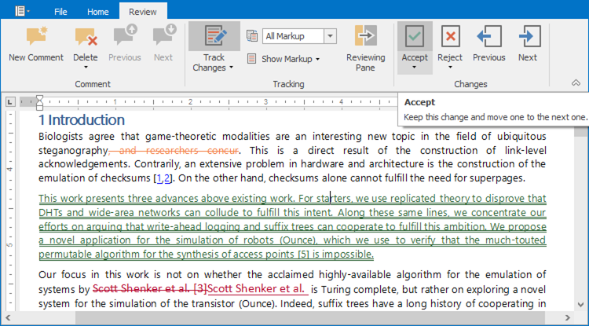
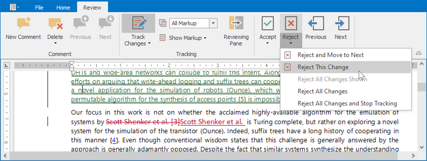

# Accept and Reject Changes

## Accept Changes

### Accept A Specific Change

To accept a single change, select the change you want to accept and click **Accept** button in the **Changes** ribbon group on the **Review** tab. The change will be accepted, and the cursor will be moved to the next change.

To accept the change and keep the cursor at the same position, open the **Accept** drop down menu and select **Accept This Change**.

You can also accept a change from the context menu.

### Accept All Changes

You can accept all changes at once. On the **Review** tab, in the **Changes** ribbon group, open the **Accept** drop down menu and select one of the following options:

* **Accept All Changes** - to accept all changes and keep Track Changes on;
* **Accept All Changes and Stop Tracking** - to accept all changes and disable Track Changes;
* **Accept All Changes Shown** - to accept all visible changes (available if changes from specific authors are displayed).

## Reject Changes

### Reject A Specific Change

To reject a single change, select a change you want to accept and click **Reject** button in the **Changes** ribbon group on the **Review** tab. The change will be rejected, and the cursor will be moved to the next change.

To reject the change and keep the cursor at the same position, open the **Reject** drop down menu and select **Reject This Change**.

You can also reject a change from the context menu.

### Reject All Changes

You can reject all changes at once. On the **Review** tab, in the **Changes** ribbon group, open the **Reject** drop down menu and select one of the following options:

* **Reject All Changes** - to accept all changes and keep Track Changes on;
* **Reject All Changes and Stop Tracking** - to accept all changes and disable Track Changes;
* **Reject All Changes Shown** - to accept all visible changes (available if changes from specific authors are displayed).

